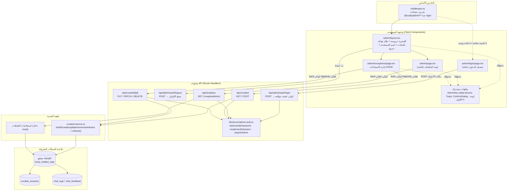
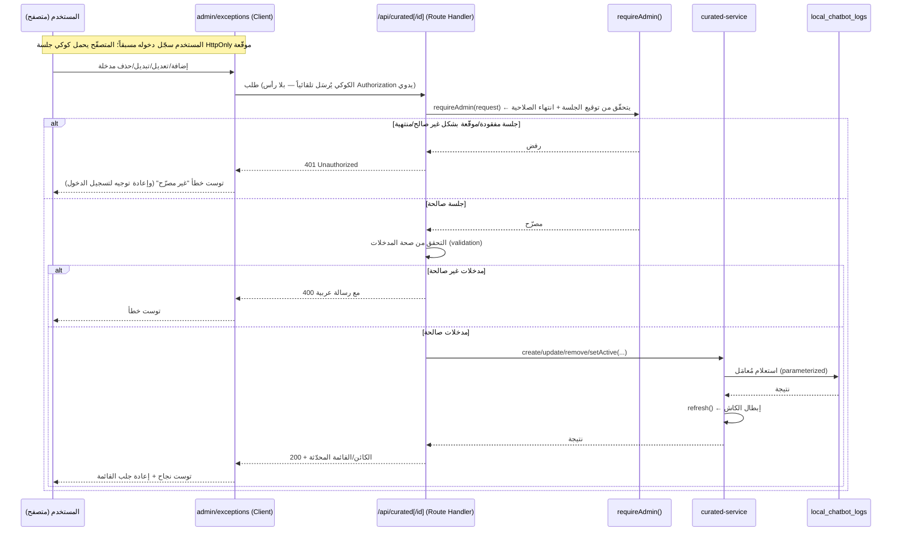

# وثيقة التصميم: لوحة الإدارة الموحّدة (admin-dashboard)

> اللغة: TypeScript / React / Next.js (App Router) — مستنتَجة من قاعدة الشيفرة الحالية.
> النطاق: **إضافي وقابل للعكس** — لا `ALTER`/`DROP` على جداول قائمة، إعادة استخدام جدول `curated_answers` كما هو، وإبقاء صفحة التحليلات كما هي وظيفياً.

## Overview

**نظرة عامة والأهداف**

نطوّر صفحة التحليلات القائمة (`app/[locale]/analytics/page.tsx` + `app/api/analytics/route.ts`) إلى **واجهة إدارة موحّدة** ذات قشرة (shell) وتنقّل مشترك، تضمّ قسمين:

1. **التحليلات (Analytics)** — الصفحة القائمة، تبقى كما هي وظيفياً، لكنها تُوضَع تحت قشرة إدارة مشتركة مع شريط تنقّل.
2. **الاستثناءات (Exceptions / Curated Answers)** — صفحة إدارة جديدة (واجهة CRUD) لجدول `curated_answers` الذي ينشئه `lib/server/curated-service.ts`، تتيح للمستخدم **إضافة/تعديل/تفعيل/تعطيل/حذف** الإجابات المنسّقة والمواقف الفقهية **دون تغيير في الشيفرة**.

الأهداف:

- **تناسق بصري**: إعادة استخدام نفس الأسلوب البصري لصفحة التحليلات (لوحة الألوان `C`، اتجاه RTL، خط `'Readex Pro'`، البطاقات/الجداول/التبويبات/النافذة المنبثقة).
- **مصدر واحد للحقيقة**: الخدمة `curated-service.ts` تملك الجدول؛ لا تكتب واجهة الـ API استعلامات SQL مباشرة، بل تستدعي طبقة تحوير (`listAll/create/update/remove`) مُضافة داخل الخدمة، وكل عملية كتابة تستدعي `refresh()` لإبطال الكاش فوراً.
- **العزل**: مجمّع اتصال خاص إلى قاعدة السجلّات المعزولة `local_chatbot_logs` (نفس نمط `analytics/route.ts` و`curated-service.ts`).
- **الأمان (بند حرجّ)**: الواجهة الحالية للتحليلات **غير محميّة**. بما أن قسم الاستثناءات يتحكّم بإجابات البوت، فإن **الوصول دون مصادقة غير مقبول**. نصمّم **مصادقة حقيقية قائمة على تسجيل الدخول (اسم مستخدم + كلمة مرور) وجلسة موقّعة**، لا سرّاً مشتركاً. الهدف: منطقة إدارة **احترافية، منظّمة، آمنة، وقابلة للتوسّع** محميّة بالكامل بجلسة `HttpOnly` موقّعة، مع دفاع بالعمق (middleware يحرس الصفحات + `requireAdmin` يحرس واجهات الـ API). كلمة المرور تُخزَّن **مُجزّأة (scrypt)** لا كنص صريح. كل ذلك **مكتفٍ ذاتياً داخل Next.js** باستخدام `node:crypto` فقط — **بلا تبعيات جديدة** ولا خدمة خارجية.
- **إضافي وقابل للعكس**: لا تعديل على مخطط الجداول القائمة، وإمكانية التراجع بحذف المسارات الجديدة.

### قرارات التصميم الرئيسية (ملخّص)

| القرار | الخيار المُوصى به | المبرّر |
|--------|-------------------|---------|
| بنية المسارات | مقطع مسار جديد `app/[locale]/admin/` بـ `layout.tsx` يحوي شريط التنقّل | أقل إزعاجاً: صفحة التحليلات تُنقل كـ `admin/page.tsx` (نفس المكوّن حرفياً)، وقشرة واحدة تخدم القسمين بلا تكرار للترويسة |
| موقع الإجابات المنسّقة | صفحة `admin/exceptions/page.tsx` | مساران متوازيان تحت قشرة واحدة |
| طبقة الكتابة | إضافة `listAll/create/update/remove` إلى `curated-service.ts` | الخدمة تملك SQL والكاش؛ الـ API طبقة نحيفة فقط |
| المصادقة | تسجيل دخول (اسم مستخدم + كلمة مرور مُجزّأة scrypt) + جلسة موقّعة `HttpOnly` (HMAC-SHA256) | مصادقة حقيقية آمنة بلا تبعيات جديدة (`node:crypto` فقط)؛ قابلة للترقية لجدول `admins` لاحقاً بلا إعادة هيكلة |
| مصدر بيانات الاعتماد | البيئة الآن: `ADMIN_USERNAME` + `ADMIN_PASSWORD_HASH` (جاهز مستقبلاً لجدول `admins` في `local_chatbot_logs`) | تشغيل فوري بلا مخطّط جديد؛ الترقية لاحقاً إضافية |
| قشرة الإدارة | تنقّل مُوجَّه بالبيانات (مصفوفة أقسام) + ترويسة تعرض المستخدم وزر خروج | إضافة قسم مستقبلي = عنصر مصفوفة واحد + صفحة |

---

# التصميم عالي المستوى (High-Level Design)

## Architecture

**بنية المسارات والقشرة (Route & Layout Structure)**

نعتمد مقطع مسار جديد `admin` تحت `app/[locale]/`، بحيث تصبح صفحة التحليلات صفحة الجذر للقسم، وتُضاف صفحة الاستثناءات بجانبها. القشرة (`layout.tsx`) تحمل شريط التنقّل المشترك المُوجَّه بالبيانات + ترويسة تعرض المستخدم وزر الخروج. صفحة تسجيل الدخول مستقلّة خارج القشرة المحميّة، والحماية تُطبَّق طبقتين: **middleware يحرس صفحات `/[locale]/admin/**` (عدا `login`)** و**`requireAdmin` يحرس واجهات الـ API**.

```
app/[locale]/
├── analytics/
│   └── page.tsx            ← (قائمة) يُعاد توجيهها إلى /admin — أو تبقى كغلاف رقيق مؤقتاً
└── admin/                  ← جديد: مقطع لوحة الإدارة (محمي عبر middleware)
    ├── login/
    │   └── page.tsx        ← جديد: صفحة تسجيل الدخول (RTL، لوحة الألوان C) — عامّة، خارج الحراسة
    ├── layout.tsx          ← جديد: القشرة المشتركة (ترويسة + تنقّل مُوجَّه بالبيانات + اسم المستخدم + زر خروج)
    ├── page.tsx            ← التحليلات (المكوّن المنقول من analytics/page.tsx كما هو وظيفياً)
    └── exceptions/
        └── page.tsx        ← جديد: إدارة الاستثناءات (CRUD)

app/api/
├── analytics/
│   └── route.ts            ← قائم: يُضاف إليه requireAdmin
├── admin/
│   └── auth/
│       ├── login/
│       │   └── route.ts    ← جديد: POST تسجيل الدخول → يُصدر كوكي الجلسة الموقّعة
│       └── logout/
│           └── route.ts    ← جديد: POST تسجيل الخروج → يمسح كوكي الجلسة
└── curated/                ← جديد
    ├── route.ts            ← GET (قائمة) + POST (إنشاء)   [requireAdmin]
    ├── refresh/
    │   └── route.ts        ← POST إبطال الكاش يدوياً       [requireAdmin]
    └── [id]/
        └── route.ts        ← PUT (تعديل) + PATCH (تبديل التفعيل) + DELETE (حذف)  [requireAdmin]

lib/server/
├── curated-service.ts      ← يُضاف: listAll / create / update / remove / setActive (طبقة تحوير)
└── admin-auth.ts           ← جديد: hashPassword/verifyPassword (scrypt) +
                              createSession/verifySession (HMAC) + requireAdmin + قراءة الجلسة في مكوّنات الخادم

middleware.ts               ← يُعدَّل: حراسة صفحات /[locale]/admin/** (عدا login) + إبقاء "/" → "/ar"
scripts/
└── gen-admin-hash.mjs      ← جديد: أداة لمرّة واحدة لتوليد ADMIN_PASSWORD_HASH عبر scrypt
```

> **مبرّر «أقل إزعاجاً»**: منطق التحليلات في `analytics/page.tsx` مكوّن `"use client"` قائم بذاته بترويسة داخلية. بنقله إلى `admin/page.tsx` ووضع الترويسة/التنقّل في `admin/layout.tsx`، نحصل على تنقّل مشترك دون تكرار كود الترويسة في صفحتين. المسار القديم `/analytics` يُحوَّل إلى `/admin` للحفاظ على الروابط القائمة (تحويل 1:1 قابل للعكس).

> **دفاع بالعمق (طبقتان)**: تُحرَس **صفحات** الإدارة في `middleware.ts` (إعادة توجيه إلى `login` عند غياب جلسة صالحة) لتجربة سلسة، بينما تُحرَس **واجهات الـ API** في كل handler عبر `requireAdmin` (401) لأنها سطح الكتابة الفعلي. لا يُعتمد على طبقة واحدة فقط. المتصفّح يرسل كوكي الجلسة `HttpOnly` تلقائياً مع كل طلب من نفس الأصل (same-origin)، فلا حاجة لأي رأس `Authorization` يدوي في العميل.

## Components and Interfaces

**خريطة المكوّنات (Component Map)**



## تدفّق البيانات (Data Flow) وموقع المصادقة

المسار: **صفحة الإدارة → واجهة CRUD → curated-service → local_chatbot_logs**، والمصادقة تقع **قبل** أي منطق في الـ route handler.



---

# التصميم منخفض المستوى (Low-Level Design)

## 1) طبقة الخدمة الجديدة في `curated-service.ts`

تُضاف دوال تحوير مُصدَّرة إلى الملف القائم. **الخدمة تملك SQL والكاش**؛ كل كتابة تنتهي بـ `refresh()`. جميع الاستعلامات مُعامَلة (`?`) لمنع حقن SQL. تُخزَّن `patterns` كـ `JSON.stringify(string[])` في عمود `patterns TEXT` (متّسق مع `seed()`).

## Data Models

**أنواع البيانات وأنواع الإدخال (Input Types)**

```typescript
// حمولة الإنشاء القادمة من الـ API (بعد التحقق)
export interface CuratedInput {
  category: "faq" | "stance"
  patterns: string[]        // قائمة أنماط غير فارغة
  answer: string            // نص الإجابة غير الفارغ
  url?: string | null       // اختياري
  priority?: number         // عدد صحيح، افتراضي 0
  active?: boolean          // افتراضي true
}

// صفّ القائمة الكامل للوحة الإدارة (يشمل غير المفعّل + updated_at)
export interface CuratedRow extends CuratedEntry {
  updated_at: string
  note?: string | null
}
```

### التواقيع (Signatures)

```typescript
/**
 * يعيد كل المدخلات (المفعّلة وغير المفعّلة) لعرض لوحة الإدارة.
 * لا يمرّ بكاش المطابقة (loadEntries يفلتر active=1 فقط).
 * الترتيب: priority تنازلياً ثم updated_at تنازلياً.
 */
export async function listAll(): Promise<CuratedRow[]>

/**
 * ينشئ مدخلة جديدة ويعيد صفّها الكامل بعد الإدراج.
 * يستدعي refresh() بعد الإدراج.
 * الشرط المسبق: input مُتحقَّق منه (patterns غير فارغة، answer غير فارغ).
 */
export async function create(input: CuratedInput): Promise<CuratedRow>

/**
 * يحدّث مدخلة قائمة بالمُعرّف. يقبل تحديثاً جزئياً للحقول القابلة للتعديل.
 * يعيد الصفّ المحدّث أو null إن لم يوجد المُعرّف.
 * يستدعي refresh() بعد التحديث.
 */
export async function update(
  id: number,
  input: Partial<CuratedInput>
): Promise<CuratedRow | null>

/**
 * يبدّل/يضبط حالة التفعيل لمدخلة (اختصار شائع لزرّ التبديل).
 * يعيد الصفّ المحدّث أو null. يستدعي refresh().
 */
export async function setActive(
  id: number,
  active: boolean
): Promise<CuratedRow | null>

/**
 * يحذف مدخلة بالمُعرّف. يعيد true إن حُذف صفّ فعلاً.
 * يستدعي refresh() بعد الحذف.
 */
export async function remove(id: number): Promise<boolean>
```

### رسومات SQL المُعامَلة (Parameterized SQL Sketches)

```typescript
// ── listAll ──
export async function listAll(): Promise<CuratedRow[]> {
  await ensureTable()
  await seed() // بذرة كسولة idempotent (متّسق مع loadEntries)
  const db = getPool()
  const [rows] = (await db.execute(
    `SELECT id, category, patterns, answer, url, mode, priority, active,
            note, DATE_FORMAT(updated_at, '%Y-%m-%d %H:%i') AS updated_at
     FROM curated_answers
     ORDER BY priority DESC, updated_at DESC`
  )) as any
  // mapRow القائم يُسقط الصفوف ذات patterns المعطوبة؛ نوسّعه لحمل updated_at/note
  return (rows as any[]).map(mapRowFull).filter(Boolean) as CuratedRow[]
}

// ── create ──
export async function create(input: CuratedInput): Promise<CuratedRow> {
  await ensureTable()
  const db = getPool()
  const [res] = (await db.execute(
    `INSERT INTO curated_answers (category, patterns, answer, url, priority, active)
     VALUES (?, ?, ?, ?, ?, ?)`,
    [
      input.category,
      JSON.stringify(input.patterns),          // string[] → JSON TEXT (متّسق مع seed)
      input.answer,
      input.url ?? null,
      input.priority ?? 0,
      input.active === false ? 0 : 1,
    ]
  )) as any
  refresh()                                     // إبطال الكاش فوراً
  return (await getById(Number(res.insertId)))! // إعادة الصفّ الكامل
}

// ── update (تحديث جزئي ديناميكي مُعامَل) ──
export async function update(
  id: number,
  input: Partial<CuratedInput>
): Promise<CuratedRow | null> {
  const sets: string[] = []
  const vals: any[] = []
  if (input.category !== undefined) { sets.push("category = ?"); vals.push(input.category) }
  if (input.patterns !== undefined) { sets.push("patterns = ?"); vals.push(JSON.stringify(input.patterns)) }
  if (input.answer   !== undefined) { sets.push("answer = ?");   vals.push(input.answer) }
  if (input.url      !== undefined) { sets.push("url = ?");      vals.push(input.url ?? null) }
  if (input.priority !== undefined) { sets.push("priority = ?"); vals.push(input.priority) }
  if (input.active   !== undefined) { sets.push("active = ?");   vals.push(input.active ? 1 : 0) }
  if (sets.length === 0) return getById(id)     // لا تغيير

  const db = getPool()
  vals.push(id)
  await db.execute(
    `UPDATE curated_answers SET ${sets.join(", ")} WHERE id = ?`,
    vals                                          // كل القيم عبر ? — لا سلاسل مُدمَجة
  )
  refresh()
  return getById(id)
}

// ── setActive ──
export async function setActive(id: number, active: boolean): Promise<CuratedRow | null> {
  const db = getPool()
  await db.execute(`UPDATE curated_answers SET active = ? WHERE id = ?`, [active ? 1 : 0, id])
  refresh()
  return getById(id)
}

// ── remove ──
export async function remove(id: number): Promise<boolean> {
  const db = getPool()
  const [res] = (await db.execute(
    `DELETE FROM curated_answers WHERE id = ?`, [id]
  )) as any
  refresh()
  return res.affectedRows > 0
}

// ── مساعد داخلي: getById (يعيد الصفّ الكامل أو null) ──
async function getById(id: number): Promise<CuratedRow | null> {
  const db = getPool()
  const [rows] = (await db.execute(
    `SELECT id, category, patterns, answer, url, mode, priority, active,
            note, DATE_FORMAT(updated_at, '%Y-%m-%d %H:%i') AS updated_at
     FROM curated_answers WHERE id = ?`, [id]
  )) as any
  if (!rows.length) return null
  return mapRowFull(rows[0])
}
```

> **ملاحظة اتساق**: `mapRowFull` امتداد لـ `mapRow` القائم؛ يعيد نفس الحقول مضافاً إليها `updated_at` و`note`، ويحافظ على `JSON.parse` الآمن لـ `patterns` (يُسقط الصفوف المعطوبة). عمود `mode` يُترك على افتراضه (`short_circuit`) — لوحة الإدارة لا تعرّضه للتحرير في النسخة الأولى.

## 2) واجهات CRUD (API Endpoints)

مساران جديدان يتبعان نفس نمط `analytics/route.ts`: `export const dynamic = "force-dynamic"`، مجمّع خاص عبر الخدمة، و`Response.json`. **كل route يبدأ بـ `requireAdmin`.** لا يكتب أي route استعلام SQL مباشرة — يستدعي الخدمة فقط.

### `app/api/curated/route.ts`

```typescript
export const dynamic = "force-dynamic"

// GET /api/curated — قائمة كل المدخلات (للوحة)
// الاستجابة 200: { entries: CuratedRow[] }
// 401 إن فشلت المصادقة
export async function GET(req: Request): Promise<Response>

// POST /api/curated — إنشاء مدخلة
// الطلب (JSON): CuratedInput
// {
//   "category": "faq" | "stance",
//   "patterns": ["نمط 1", "نمط 2"],
//   "answer": "نص الإجابة",
//   "url": "https://..." | null,
//   "priority": 0,
//   "active": true
// }
// الاستجابة 201: { entry: CuratedRow }
// 400: { error: "رسالة تحقّق عربية" }   |   401: غير مصرّح
export async function POST(req: Request): Promise<Response>
```

### `app/api/curated/[id]/route.ts`

```typescript
export const dynamic = "force-dynamic"

// PUT /api/curated/:id — تعديل كامل/جزئي
// الطلب (JSON): Partial<CuratedInput>
// الاستجابة 200: { entry: CuratedRow }   |   404 إن لم يوجد   |   400/401
export async function PUT(req: Request, ctx: { params: { id: string } }): Promise<Response>

// PATCH /api/curated/:id — تبديل التفعيل فقط
// الطلب (JSON): { "active": true | false }
// الاستجابة 200: { entry: CuratedRow }   |   404 / 400 / 401
export async function PATCH(req: Request, ctx: { params: { id: string } }): Promise<Response>

// DELETE /api/curated/:id — حذف
// الاستجابة 200: { deleted: true }   |   404: { deleted: false }   |   401
export async function DELETE(req: Request, ctx: { params: { id: string } }): Promise<Response>
```

### مخطّط طلب الكاش

قسم «تحديث الكاش» في الواجهة يستدعي أي عملية كتابة (التي تستدعي `refresh()` أصلاً)، أو نضيف نقطة صريحة:

```typescript
// POST /api/curated/refresh — إبطال كاش المطابقة يدوياً
// الاستجابة 200: { refreshed: true }   |   401
// داخلياً: يستدعي curatedService.refresh()
```

### شكل نموذجي للاستجابة (مثال)

```jsonc
// GET /api/curated  → 200
{
  "entries": [
    {
      "id": 7,
      "category": "stance",
      "patterns": ["التراويح", "صلاة التراويح", "تراويح"],
      "answer": "صلاة التراويح (جماعةً) غير مُقرّة…",
      "url": null,
      "mode": "short_circuit",
      "priority": 10,
      "active": true,
      "note": "منقول من كتلة استثناء system-prompts.ts",
      "updated_at": "2025-02-14 09:31"
    }
  ]
}
```

## 3) آلية المصادقة القائمة على الجلسة (بالتحديد)

**البند الحرجّ**: صفحة `/analytics` وواجهة `/api/analytics` حالياً **مفتوحتان بلا مصادقة**. بما أن قسم الاستثناءات يتحكّم بإجابات البوت، فإن **الوصول دون مصادقة غير مقبول**. نعتمد **مصادقة حقيقية قائمة على تسجيل الدخول + جلسة موقّعة**، مبنيّة بالكامل على `node:crypto` (**بلا تبعيات جديدة**، بلا مكتبة JWT، بلا خدمة خارجية).

نموذج المصادقة من ثلاثة أجزاء: **(أ)** تجزئة/تحقّق كلمة المرور بـ scrypt، **(ب)** جلسة موقّعة بـ HMAC-SHA256 في كوكي `HttpOnly`، **(ج)** إنفاذ بطبقتين (middleware للصفحات + `requireAdmin` للـ API).

### البيئة

```dotenv
# .env.local (+ .env.local.example) — كلّها خادمية بحتة، لا NEXT_PUBLIC_
ADMIN_USERNAME=            # اسم المستخدم الإداري (نص)
ADMIN_PASSWORD_HASH=       # ناتج scrypt بصيغة "saltHex:hashHex" (لا كلمة مرور صريحة أبداً)
ADMIN_SESSION_SECRET=      # سرّ عشوائي طويل (32+ بايت hex) لتوقيع الجلسة HMAC
# ADMIN_SESSION_TTL_HOURS=8   # اختياري: مدة صلاحية الجلسة بالساعات (افتراضي 8)
```

> **جاهزية مستقبلية (خارج النطاق الآن)**: مصدر بيانات الاعتماد اليوم هو البيئة (مسؤول واحد). التصميم يعزل «مصدر المستخدم» خلف دالة `lookupAdmin(username)` الداخلية، بحيث يمكن لاحقاً استبدال قراءة البيئة بجدول `admins (id, username, password_hash, created_at)` في `local_chatbot_logs` **بلا إعادة هيكلة** لبقية طبقة المصادقة (نفس `verifyPassword`/`createSession`). هذا الجدول **ليس** ضمن نطاق العمل الحالي — يُذكر فقط لضمان التوسّع دون تكلفة إعادة تصميم.

### أ) تجزئة كلمة المرور (scrypt) — `hashPassword` / `verifyPassword`

```typescript
import { scryptSync, randomBytes, timingSafeEqual } from "node:crypto"

const SCRYPT_KEYLEN = 64

/**
 * يُجزّئ كلمة مرور صريحة عبر scrypt مع ملح عشوائي.
 * يعيد سلسلة "saltHex:hashHex" جاهزة للتخزين في ADMIN_PASSWORD_HASH.
 * الشرط اللاحق: النتيجة تحوي فاصلة نقطية واحدة، وكل شقّ hex صالح.
 */
export function hashPassword(password: string): string {
  const salt = randomBytes(16)
  const hash = scryptSync(password, salt, SCRYPT_KEYLEN)
  return `${salt.toString("hex")}:${hash.toString("hex")}`
}

/**
 * يتحقّق من كلمة مرور مقابل مخزون "saltHex:hashHex" بمقارنة ثابتة الزمن.
 * يعيد false عند أي تشوّه في الصيغة (بلا رمي استثناء) أو عند عدم التطابق.
 * الشرط اللاحق: true ⟺ scrypt(password, salt) == hash المخزّن (بايتياً).
 */
export function verifyPassword(password: string, stored: string): boolean {
  const [saltHex, hashHex] = (stored ?? "").split(":")
  if (!saltHex || !hashHex) return false
  const salt = Buffer.from(saltHex, "hex")
  const expected = Buffer.from(hashHex, "hex")
  if (expected.length !== SCRYPT_KEYLEN) return false
  const actual = scryptSync(password, salt, SCRYPT_KEYLEN)
  return actual.length === expected.length && timingSafeEqual(actual, expected)
}
```

**سكربت توليد الهاش لمرّة واحدة** (`scripts/gen-admin-hash.mjs`): يقرأ كلمة المرور من `argv`/إدخال ويطبع سطر `ADMIN_PASSWORD_HASH=...` لنسخه إلى `.env.local`:

```bash
# تشغيل لمرّة واحدة لتوليد الهاش (بلا تخزين كلمة مرور صريحة في أي مكان)
node scripts/gen-admin-hash.mjs 'كلمة-المرور-هنا'
# المخرج مثلاً:
# ADMIN_PASSWORD_HASH=9f3c...:c1a7...
```

### ب) الجلسة الموقّعة (HMAC-SHA256) — `createSession` / `verifySession`

الجلسة **مكتفية ذاتياً** (stateless): حمولة JSON مُرمّزة base64url + توقيع HMAC، بلا مكتبة JWT.

```typescript
import { createHmac, timingSafeEqual } from "node:crypto"

interface SessionPayload { sub: string; iat: number; exp: number }

const b64url = (b: Buffer) => b.toString("base64url")
function sign(data: string): string {
  return createHmac("sha256", process.env.ADMIN_SESSION_SECRET!).update(data).digest("base64url")
}

/**
 * ينشئ قيمة كوكي جلسة موقّعة للمستخدم.
 * الصيغة: "<payloadB64url>.<signatureB64url>" حيث payload = { sub, iat, exp }.
 * exp = iat + TTL (افتراضي 8 ساعات، أو ADMIN_SESSION_TTL_HOURS).
 * الشرط اللاحق: verifySession(createSession(u)) == { username: u } (ضمن الصلاحية).
 */
export function createSession(username: string): string {
  const ttlH = Number(process.env.ADMIN_SESSION_TTL_HOURS ?? 8)
  const now = Math.floor(Date.now() / 1000)
  const payload: SessionPayload = { sub: username, iat: now, exp: now + ttlH * 3600 }
  const body = b64url(Buffer.from(JSON.stringify(payload)))
  return `${body}.${sign(body)}`
}

/**
 * يتحقّق من قيمة كوكي الجلسة: يعيد { username } عند صحّة التوقيع وعدم انتهاء exp،
 * وإلا null. مقارنة التوقيع ثابتة الزمن (timingSafeEqual) لمنع تسريب التوقيت.
 * الشرط اللاحق: null إذا عُدِّل أي بايت في الحمولة أو التوقيع، أو إذا exp < now.
 */
export function verifySession(value: string | undefined | null): { username: string } | null {
  if (!value) return null
  const dot = value.lastIndexOf(".")
  if (dot <= 0) return null
  const body = value.slice(0, dot)
  const givenSig = value.slice(dot + 1)
  const expectedSig = sign(body)
  const a = Buffer.from(givenSig), b = Buffer.from(expectedSig)
  if (a.length !== b.length || !timingSafeEqual(a, b)) return null   // توقيع غير مطابق ⇒ مرفوض
  try {
    const p = JSON.parse(Buffer.from(body, "base64url").toString()) as SessionPayload
    if (typeof p.sub !== "string" || typeof p.exp !== "number") return null
    if (p.exp < Math.floor(Date.now() / 1000)) return null           // منتهية ⇒ مرفوضة
    return { username: p.sub }
  } catch { return null }
}
```

### ج) حراس الوصول — `requireAdmin` + قراءة الجلسة في مكوّنات الخادم

```typescript
const COOKIE_NAME = "admin_session"

function readSessionCookie(req: Request): string | null {
  const cookie = req.headers.get("cookie") ?? ""
  const m = cookie.match(/(?:^|;\s*)admin_session=([^;]+)/)
  return m ? decodeURIComponent(m[1]) : null
}

/**
 * حارس واجهات الـ API: يعيد Response 401 عند غياب/بطلان الجلسة، أو null عند الصحّة.
 * الاستعمال في كل route:  const deny = requireAdmin(req); if (deny) return deny
 */
export function requireAdmin(req: Request): Response | null {
  const session = verifySession(readSessionCookie(req))
  return session ? null : Response.json({ error: "غير مصرّح" }, { status: 401 })
}

/**
 * مساعد لمكوّنات الخادم/التخطيط: يقرأ الجلسة من cookies() ويعيد { username } | null.
 * تستعمله admin/layout.tsx لعرض اسم المستخدم (والتأكيد الخادمي كطبقة إضافية).
 */
export function getAdminSession(): { username: string } | null   // عبر next/headers cookies()

/**
 * مصدر بيانات الاعتماد (معزول للترقية المستقبلية لجدول admins).
 * الآن: يقرأ من ADMIN_USERNAME/ADMIN_PASSWORD_HASH.
 */
function lookupAdmin(username: string): { username: string; passwordHash: string } | null
```

### مسارات المصادقة (Auth Routes)

```typescript
// POST /api/admin/auth/login
// الطلب (JSON): { "username": string, "password": string }
// المنطق: lookupAdmin(username) ثم verifyPassword(password, hash).
//   عند النجاح: Set-Cookie: admin_session=<createSession(username)>;
//               HttpOnly; Secure; SameSite=Lax; Path=/; Max-Age=<ttl>
//   الاستجابة 200: { ok: true, username }
//   عند الفشل: 401 { error: "بيانات الدخول غير صحيحة" } (رسالة موحّدة لا تميّز
//              بين اسم مستخدم خاطئ وكلمة مرور خاطئة — منعاً لتعداد المستخدمين)
export async function POST(req: Request): Promise<Response>

// POST /api/admin/auth/logout
// المنطق: Set-Cookie: admin_session=; Max-Age=0 (مسح فوري) بنفس السمات.
//   الاستجابة 200: { ok: true }
export async function POST(req: Request): Promise<Response>
```

> **سمات الكوكي (حرجة للأمان)**: `HttpOnly` (لا وصول من JavaScript ⇒ مناعة ضد سرقة الجلسة عبر XSS)، `Secure` (HTTPS فقط)، `SameSite=Lax` (تخفيف CSRF مع إبقاء التنقّل العادي يعمل)، `Path=/`، و`Max-Age` مطابق لـ TTL.

### الإنفاذ بطبقتين (Defense in Depth)

- **صفحات الإدارة عبر `middleware.ts`**: تُحرَس مسارات `/[locale]/admin/**` (عدا `/[locale]/admin/login`). عند غياب جلسة صالحة ⇒ إعادة توجيه إلى صفحة تسجيل الدخول. **تنبيه على المُطابِق**: المُطابِق الحالي يستثني `api`؛ نُبقيه كذلك لكن نُضيف منطقاً داخل `middleware()` يفحص مسارات الإدارة (الصفحات) ويتحقّق من الكوكي، مع **الحفاظ على تحويل `/` → `/ar` القائم**. لا نضع حراسة الـ API في middleware (المُطابِق يستثنيها عمداً) — تبقى في الـ handlers.

  ```typescript
  // middleware.ts (توضيحي)
  export async function middleware(request: NextRequest) {
    const { pathname } = request.nextUrl
    if (pathname === "/") return NextResponse.redirect(new URL("/ar", request.url))

    // حراسة صفحات الإدارة فقط (عدا login)
    const adminPage = /^\/[^/]+\/admin(?:\/(?!login).*)?$/.test(pathname)
    if (adminPage) {
      const token = request.cookies.get("admin_session")?.value
      if (!verifySession(token)) {
        const locale = pathname.split("/")[1] || "ar"
        const url = new URL(`/${locale}/admin/login`, request.url)
        url.searchParams.set("next", pathname)
        return NextResponse.redirect(url)
      }
    }
    return NextResponse.next()
  }

  export const config = {
    matcher: "/((?!api|static|.*\\..*|_next).*)"   // يبقى كما هو: يستثني api
  }
  ```

  > ملاحظة تشغيلية: `verifySession` تعتمد `node:crypto` (`createHmac`). middleware في Next.js يعمل على Edge افتراضياً؛ لضمان توفّر `node:crypto` نُصرّح `export const runtime = "nodejs"` حيثما يلزم، أو نُبقي منطق التحقّق البسيط (تحليل base64url + HMAC) متوافقاً. الإنفاذ المُلزِم يظلّ في الـ API.

- **واجهات الـ API عبر `requireAdmin`**: كل من `/api/curated`، `/api/curated/[id]`، `/api/curated/refresh`، و`/api/analytics` يبدأ بـ `const deny = requireAdmin(req); if (deny) return deny`. هذه هي الطبقة المُلزِمة لأنها سطح الكتابة/القراءة الفعلي.

### تبسيط العميل (لا رموز في العميل)

مفهوم `AdminGate` القديم (إدخال رمز يدوي + تخزينه + إرفاقه في كل fetch) **مُلغى**. الآن:
- المصادقة تُفرَض **خادمياً** (middleware + `requireAdmin`)، فلا حاجة لمعالجة رموز في العميل.
- كوكي الجلسة `HttpOnly` يُرسَل **تلقائياً** مع طلبات `fetch` من نفس الأصل — **بلا رأس `Authorization` يدوي** ولا قراءة كوكي من JavaScript (وهي أصلاً محجوبة بـ HttpOnly).
- صفحة تسجيل الدخول ترسل `POST` واحداً؛ الباقي يعتمد على الكوكي. عند تلقّي `401` من أي fetch، يعيد العميل التوجيه إلى `login`.

## 4) قواعد التحقّق من المدخلات (Validation)

تحقّق خادمي في الـ route قبل استدعاء الخدمة (دالة نقيّة قابلة للاختبار):

```typescript
export interface ValidationResult { ok: boolean; error?: string; value?: CuratedInput }

/**
 * يتحقّق من حمولة إنشاء/تعديل مدخلة منسّقة.
 * القواعد:
 *  - category ∈ {"faq","stance"}                     وإلا: "الفئة غير صالحة"
 *  - patterns مصفوفة نصوص، بعد trim تحوي عنصراً واحداً غير فارغ على الأقل
 *                                                     وإلا: "يجب إدخال نمط واحد على الأقل"
 *  - answer نص غير فارغ بعد trim                       وإلا: "نص الإجابة مطلوب"
 *  - url: اختياري؛ إن وُجد فسلسلة http(s) صالحة أو null  وإلا: "الرابط غير صالح"
 *  - priority: عدد صحيح (افتراضي 0)                    وإلا: "الأولوية يجب أن تكون عدداً صحيحاً"
 *  - active: قيمة منطقية (افتراضي true)
 * ينظّف patterns (trim + إسقاط الفارغ + إزالة التكرار).
 */
export function validateCuratedInput(body: unknown): ValidationResult
```

- **الإنشاء (POST)**: يتطلّب `category` و`patterns` و`answer`.
- **التعديل (PUT)**: تحقّق جزئي — تُتحقَّق الحقول الموجودة فقط، ويجب ألّا يُفرَّغ حقل إلزامي (مثلاً `patterns: []` مرفوض).
- **التبديل (PATCH)**: `active` منطقية إلزامية فقط.
- عند الفشل: `400` مع رسالة عربية واضحة، ولا يُلمس الجدول.

تحويل واجهة → خدمة: تقبل الواجهة `patterns` كنص مفصول بفواصل/أسطر جديدة، وتحوّله إلى `string[]` قبل الإرسال:

```typescript
function parsePatterns(raw: string): string[] {
  return raw
    .split(/[\n,]+/)
    .map(s => s.trim())
    .filter(Boolean)
}
```

## 5) بنية صفحة الاستثناءات (Exceptions Page Component)

مكوّن `"use client"` يعيد استخدام لوحة الألوان `C` وأنماط `thStyle/tdStyle/StatCard/Badge/EmptyState` وأسلوب النافذة المنبثقة من صفحة التحليلات (تُستخرج إلى `admin/_shared.tsx` لتجنّب التكرار).

```typescript
// app/[locale]/admin/exceptions/page.tsx
export default function ExceptionsPage() {
  const [rows, setRows] = useState<CuratedRow[] | null>(null)
  const [loading, setLoading] = useState(true)
  const [error, setError] = useState<string | null>(null)
  const [toast, setToast] = useState<{ kind: "ok" | "err"; msg: string } | null>(null)
  const [editing, setEditing] = useState<CuratedRow | null>(null)   // للنموذج (إضافة/تعديل)
  const [confirmDel, setConfirmDel] = useState<CuratedRow | null>(null)
  const [refreshing, setRefreshing] = useState(false)

  // fetchList()  → GET /api/curated (كوكي الجلسة HttpOnly يُرسَل تلقائياً — بلا رأس مصادقة)
  // handleCreate(input)   → POST /api/curated  ثم refetch + توست
  // handleUpdate(id,input)→ PUT  /api/curated/:id
  // handleToggle(row)     → PATCH /api/curated/:id { active: !row.active }
  // handleDelete(row)     → DELETE /api/curated/:id (بعد تأكيد)
  // handleCacheRefresh()  → POST /api/curated/refresh + توست "تم تحديث الكاش"
}
```

### تخطيط الواجهة

- **ترويسة القسم**: عنوان «إدارة الاستثناءات» + زرّ «➕ إضافة» + زرّ «🔄 تحديث الكاش» (بنفس أسلوب زرّ التحديث في التحليلات).
- **الجدول**: أعمدة `#(id)` | `الفئة (faq/stance كـ Badge)` | `الأنماط (شرائح)` | `معاينة الإجابة (مقتطعة)` | `الرابط` | `الأولوية` | `مفعّل (مفتاح تبديل)` | `آخر تحديث` | `إجراءات (تعديل/حذف)`.
- **نموذج الإضافة/التعديل** (نافذة منبثقة بأسلوب `ConvModal`): حقول `category` (قائمة `faq|stance`)، `patterns` (منطقة نص متعدد الأسطر/فواصل)، `answer` (منطقة نص)، `url` (اختياري)، `priority` (رقم)، `active` (مربّع اختيار). يخدم زرّ «➕ إضافة استثناء عاجل» إدخالَ المواقف العاجلة بسرعة.
- **تأكيد الحذف**: `ConfirmDialog` بنافذة صغيرة قبل `DELETE`.
- **RTL + `'Readex Pro'`** ولوحة `C` نفسها للاتساق البصري التام مع التحليلات.
- **لا معالجة رموز**: الطلبات تعتمد كوكي الجلسة `HttpOnly` تلقائياً؛ عند `401` يعيد العميل التوجيه إلى تسجيل الدخول.

### صفحة تسجيل الدخول `admin/login/page.tsx`

مكوّن `"use client"` بسيط بلوحة الألوان `C` واتجاه RTL:
- حقلا `username` و`password` + زرّ «تسجيل الدخول».
- عند الإرسال: `POST /api/admin/auth/login` بالجسم `{ username, password }`.
- عند `200`: إعادة توجيه إلى `next` (من مَعلمة الاستعلام) أو `/{locale}/admin`.
- عند `401`: عرض رسالة موحّدة «بيانات الدخول غير صحيحة» (لا تكشف أيّ الحقلين خاطئ).
- عامّة (خارج حراسة القشرة)، وإلا لتعذّر الوصول إليها.

### القشرة المشتركة `admin/layout.tsx` — تنقّل مُوجَّه بالبيانات + خروج

القشرة تُبنى حول **مصفوفة أقسام** بحيث تكون إضافة قسم مستقبلي = **عنصر واحد + صفحة**، بلا تعديل في القشرة:

```typescript
// تعريف الأقسام (data-driven) — إضافة قسم مستقبلي = عنصر جديد هنا + صفحته فقط
interface AdminSection { key: string; label: string; href: string; icon: string }

const ADMIN_SECTIONS: AdminSection[] = [
  { key: "analytics",  label: "التحليلات",  href: "/admin",            icon: "📊" },
  { key: "exceptions", label: "الاستثناءات", href: "/admin/exceptions", icon: "⚠️" },
  // أقسام مستقبلية تُضاف هنا فقط، مثل:
  // { key: "contacts", label: "جهات الاتصال", href: "/admin/contacts", icon: "📇" },
]

// AdminLayout:
//   - يقرأ الجلسة خادمياً عبر getAdminSession() لعرض اسم المستخدم (طبقة تأكيد إضافية).
//   - ترويسة: الشعار + اسم المستخدم المسجّل + زر «تسجيل الخروج» (POST /api/admin/auth/logout ثم توجيه للـ login).
//   - شريط جانبي/تبويبات يُبنى بـ ADMIN_SECTIONS.map(...) مع تمييز النشط عبر usePathname().
//   - لا AdminGate ولا معالجة رموز: الحماية مفروضة خادمياً (middleware + requireAdmin).
```

> **قابلية التوسّع**: بما أن التنقّل مُشتقّ من `ADMIN_SECTIONS`، فإن أي قسم إداري جديد (جهات اتصال، مستخدمون، إعدادات...) يُضاف بسطر واحد في المصفوفة + ملف صفحة تحت `admin/`، ويُحرَس تلقائياً بنفس middleware و`requireAdmin`.

## 6) تحسينات تجربة الاستخدام (UX)

- **توست نجاح/خطأ**: مكوّن `Toast` بألوان `C.greenPale/C.redPale` يظهر بعد كل عملية.
- **تأكيد الحذف**: حوار تأكيد قبل الحذف النهائي.
- **إعادة الجلب بعد التحوير**: بعد كل كتابة ناجحة، إعادة `fetchList()` (بسيط وموثوق؛ يمكن لاحقاً تحسينه بتحديث تفاؤلي).
- **تغذية راجعة للكاش**: زرّ «تحديث الكاش» يعرض توست «تم تحديث الكاش — ستُطبَّق التغييرات فوراً».
- **حالات فارغة/خطأ**: إعادة استخدام `EmptyState` وشريط الخطأ الأحمر من التحليلات.

---

## Error Handling

**معالجة الأخطاء**

| السيناريو | الشرط | استجابة النظام | التعافي |
|-----------|-------|-----------------|---------|
| جلسة غير صالحة (API) | كوكي مفقود/توقيع غير مطابق/منتهية الصلاحية | `401 { error: "غير مصرّح" }` قبل أي منطق (`requireAdmin`) | العميل يعرض توست ويعيد التوجيه إلى `login` |
| صفحة إدارة بلا جلسة | زيارة `/[locale]/admin/**` (عدا login) بلا جلسة صالحة | إعادة توجيه `middleware` إلى `login?next=...` | المستخدم يسجّل الدخول ثم يُعاد للصفحة المقصودة |
| فشل تسجيل الدخول | اسم مستخدم غير موجود أو كلمة مرور خاطئة (`verifyPassword=false`) | `401 { error: "بيانات الدخول غير صحيحة" }` (رسالة موحّدة) | العميل يعرض الرسالة؛ لا يُكشَف أيّ الحقلين خاطئ |
| إعداد ناقص | غياب `ADMIN_USERNAME`/`ADMIN_PASSWORD_HASH`/`ADMIN_SESSION_SECRET` | تسجيل الدخول يفشل (مغلق افتراضياً) و`requireAdmin` يرفض | تنبيه للمشغّل بضبط البيئة قبل النشر |
| مدخلات غير صالحة | فشل `validateCuratedInput` | `400 { error: "رسالة عربية" }` بلا مساس بالجدول | العميل يُبرز الحقل ويعرض التوست |
| مُعرّف غير موجود | `update/setActive` يعيد `null` أو `remove` يعيد `false` | `404` (`{ deleted: false }` للحذف) | العميل يعيد الجلب ويعرض «العنصر غير موجود» |
| صفّ `patterns` معطوب | `JSON.parse` يفشل في `mapRowFull` | يُسقَط الصفّ من `listAll()` فقط | بقية القائمة تعمل؛ سلوك متّسق مع `mapRow` |
| خطأ قاعدة بيانات | استثناء من `mysql2` | يُلتقط في الـ route ويُعاد `500 { error }` مع `console.error` | نمط `analytics/route.ts` القائم |
| فشل الشبكة في العميل | استثناء `fetch` | توست خطأ + إبقاء الحالة السابقة | زرّ إعادة المحاولة/التحديث |

جميع الـ route handlers تلفّ المنطق في `try/catch` تعيد `500` عند الاستثناءات غير المتوقّعة، تماشياً مع نمط `app/api/analytics/route.ts` القائم.

## Correctness Properties

**خصائص الصحّة**

Property 1: ∀ عملية كتابة ناجحة (create/update/setActive/remove) ⟹ يُستدعى `refresh()` بعدها، فتعكس أول مطابقة تالية الحالة الجديدة.

Property 2: ∀ مدخلة مُنشأة عبر `create(input)` ⟹ `listAll()` اللاحقة تحوي صفّاً بنفس `category/patterns/answer` وبـ `id` جديد.

Property 3: ∀ `patterns: string[]` مُدخَلة ⟹ تُخزَّن كـ `JSON.stringify` وتُقرأ كنفس المصفوفة عبر `mapRowFull` (رحلة ذهاب-إياب بلا فقد)، متّسق مع صيغة `seed()`.

Property 4: ∀ حمولة تفشل التحقّق ⟹ يعيد الـ API `400` ولا يُعدَّل الجدول (لا أثر جانبي).

Property 5: ∀ طلب API (قراءة/كتابة) بلا جلسة صالحة ⟹ يعيد `requireAdmin` القيمة `401` ولا يصل إلى الخدمة (المصادقة تسبق المنطق).

Property 6: ∀ استعلام كتابة ⟹ كل القيم تمرّ عبر معاملات `?` (لا سلاسل SQL مُدمَجة) — مناعة ضد الحقن.

Property 7: `remove(id)` لمُعرّف غير موجود ⟹ يعيد `false` والـ API يعيد `404`، دون خطأ.

Property 8: `update`/`setActive` لمُعرّف غير موجود ⟹ يعيد `null` والـ API يعيد `404`.

Property 9: صفّ بـ `patterns` غير صالح JSON يُسقَط من `listAll()` (لا يُعطّل بقية القائمة) — نفس ضمانة `mapRow` القائمة.

Property 10: لا مسار جديد ينفّذ `ALTER`/`DROP`؛ الجدول ينشأ فقط عبر `CREATE TABLE IF NOT EXISTS` القائم (عدم المساس).

### خصائص المصادقة والجلسة (Auth Properties)

Property 11: لا جلسة ⇒ منع — ∀ زيارة صفحة `/[locale]/admin/**` (عدا `login`) بلا جلسة صالحة ⟹ `middleware` يعيد توجيهاً إلى `login`؛ و∀ طلب API مماثل ⟹ `requireAdmin` يعيد `401`. (لا وصول عبر أيّ الطبقتين.)

Property 12: رفض العبث بالتوقيع — ∀ قيمة جلسة عُدِّل فيها أيّ بايت (في الحمولة أو التوقيع) ⟹ `verifySession` يعيد `null` (فشل المقارنة الثابتة الزمن على HMAC) ⟹ يُرفض الوصول.

Property 13: تحقّق كلمة المرور بـ scrypt وثبات الزمن — ∀ كلمة مرور `p` ومخزون `s = hashPassword(p0)` ⟹ `verifyPassword(p, s)` يعيد `true` ⟺ `p == p0` بايتياً، والمقارنة عبر `timingSafeEqual` (لا تسريب توقيت)؛ وأيّ صيغة مخزون مشوّهة ⟹ `false` بلا استثناء.

Property 14: رحلة الجلسة ذهاب-إياب — ∀ اسم مستخدم `u` ⟹ `verifySession(createSession(u)) == { username: u }` طالما لم تنتهِ `exp`.

Property 15: انتهاء الصلاحية — ∀ جلسة بـ `exp < now` ⟹ `verifySession` يعيد `null` حتى لو كان التوقيع صحيحاً.

Property 16: الخروج يُبطل الوصول — بعد استدعاء `logout` (كوكي `Max-Age=0`) ⟹ الطلبات اللاحقة بلا كوكي صالح ⟹ `401`/إعادة توجيه (لا وصول).

Property 17: فصل الطبقتين — صفحات الإدارة تُحرَس بـ `middleware`، وواجهات الـ API تُحرَس بـ `requireAdmin` داخل الـ handler؛ لا تعتمد إحدى الطبقتين على الأخرى (دفاع بالعمق).

Property 18: لا تسريب أسرار للعميل — لا يُرسَل `ADMIN_PASSWORD_HASH` ولا `ADMIN_SESSION_SECRET` ولا كلمة المرور الصريحة إلى العميل؛ كوكي الجلسة `HttpOnly` غير قابل للقراءة من JavaScript.

---

## قسم الأمان (Security)

- **المصادقة (قائمة على الجلسة)**: تسجيل دخول باسم مستخدم + كلمة مرور، ثم جلسة موقّعة. لا سرّ مشترك.
- **تجزئة كلمة المرور**: `scrypt` (من `node:crypto`) مع ملح عشوائي، مخزّنة كـ `saltHex:hashHex` في `ADMIN_PASSWORD_HASH`. **لا كلمة مرور صريحة** في أي مكان. التحقّق عبر `timingSafeEqual` (ثابت الزمن).
- **توقيع الجلسة**: HMAC-SHA256 بـ `ADMIN_SESSION_SECRET` على حمولة `{ sub, iat, exp }` (base64url). التحقّق يقارن التوقيع مقارنةً ثابتة الزمن ويرفض الحمولة المُعدَّلة أو المنتهية.
- **كوكي الجلسة**: `HttpOnly` (مناعة ضد سرقة الجلسة عبر XSS — لا وصول من JS)، `Secure` (HTTPS فقط)، `SameSite=Lax` (تخفيف CSRF)، `Path=/`، `Max-Age` = مدة الصلاحية.
- **إنفاذ بطبقتين (دفاع بالعمق)**: `middleware` يحرس صفحات `/[locale]/admin/**` (عدا `login`)، و`requireAdmin` يحرس كل واجهات الـ API (`curated*` و`analytics`) — كلاهما مُلزِم مستقلاً.
- **تبسيط العميل**: لا معالجة رموز في العميل؛ الكوكي `HttpOnly` يُرسَل تلقائياً same-origin بلا رأس `Authorization` يدوي.
- **عدم كشف المستخدمين**: فشل تسجيل الدخول يعيد رسالة موحّدة لا تميّز بين اسم مستخدم أو كلمة مرور خاطئة.
- **مغلق افتراضياً**: غياب أيّ من `ADMIN_USERNAME`/`ADMIN_PASSWORD_HASH`/`ADMIN_SESSION_SECRET` يمنع تسجيل الدخول وينتج عنه رفض `requireAdmin`.
- **أسرار خادمية بحتة**: كل متغيّرات البيئة بلا بادئة `NEXT_PUBLIC_`، لا تُسرَّب للعميل.
- **استعلامات مُعامَلة**: 100% من عمليات القراءة/الكتابة عبر `?` — لا حقن SQL.
- **مجمّع معزول**: مجمّع `mysql2` خاص إلى `local_chatbot_logs` فقط (نمط `curated-service.ts`/`analytics/route.ts`)، لا مساس بقواعد المحتوى (`ka_db`/`alkafeel_projects`).
- **تنبيه صريح**: يجب تقديم الواجهة عبر **HTTPS** في الإنتاج (سمة `Secure` على الكوكي تفترض ذلك)، ونشر منطقة الإدارة بلا ضبط بيئة المصادقة **غير مقبول**.
- **سطح الحقن في `patterns`**: تُبنى تعابير Regex للمطابقة من `patterns` مع تهريب الرموز الخاصة (`replace(/[.*+?^${}()|[\]\\]/g, "\\$&")`) — قائم في `matchCurated`، ويُحافَظ عليه.

## الأداء (Performance)

- كاش المطابقة (`CACHE_TTL_MS = 5 دقائق`) يبقى كما هو للقراءة الساخنة في مسار الدردشة؛ `refresh()` يبطله فوراً بعد أي تحرير فتظهر التغييرات دون انتظار انتهاء الـ TTL.
- `listAll()` للوحة الإدارة لا يمرّ بكاش المطابقة (استعلام مباشر) — حجم الجدول صغير (عشرات الصفوف)، والاستعلام مفهرس على `(active, priority)` و`category`.
- `connectionLimit: 3` كافٍ لأداة إدارة منخفضة التزامن.
- `dynamic = "force-dynamic"` + `Cache-Control: no-store` يمنع أي تخزين مؤقت لبيانات لوحة الإدارة.

## المخاطر والمقايضات (Risks / Tradeoffs)

- **مسؤول واحد عبر البيئة الآن مقابل جدول `admins` لاحقاً**: `ADMIN_USERNAME`/`ADMIN_PASSWORD_HASH` تكفي لمسؤول واحد بلا مخطّط جديد. عيبها: لا مستخدمون متعدّدون ولا تدقيق لكل مستخدم. مُخفَّف معمارياً بعزل `lookupAdmin(username)`، فالترقية لجدول `admins` في `local_chatbot_logs` **إضافية وبلا إعادة هيكلة** (خارج النطاق الآن).
- **تدوير سرّ الجلسة (`ADMIN_SESSION_SECRET`)**: تغيير السرّ **يُبطل كل الجلسات القائمة فوراً** (تصبح التواقيع غير مطابقة) ويستلزم إعادة تسجيل دخول الجميع. هذا مقبول ومقصود كوسيلة «إبطال شامل» عند الاشتباه بتسريب؛ يُنصح بتوليد سرّ عشوائي قوي وتخزينه بأمان. الجلسة عديمة الحالة (stateless)، لذا لا يوجد إبطال لجلسة مفردة قبل انتهائها سوى عبر تدوير السرّ أو انتظار `exp`.
- **جلسة عديمة الحالة**: مكتفية ذاتياً بلا تخزين خادمي (بسيطة، بلا تبعية)، لكن لا يمكن إبطال جلسة واحدة منفردة قبل `exp`؛ يُخفَّف بـ TTL معقول (افتراضي 8 ساعات) وبإمكان تدوير السرّ للإبطال الشامل. الخروج يمسح الكوكي من المتصفّح.
- **middleware على Edge مقابل Node**: التحقّق يستخدم `node:crypto`؛ عند الحاجة نُصرّح `runtime = "nodejs"`. الطبقة المُلزِمة تبقى `requireAdmin` في الـ API بأي حال.
- **نقل صفحة التحليلات إلى `admin/`**: يغيّر المسار العام؛ يُخفَّف بتحويل `/analytics → /admin` (قابل للعكس).
- **حذف مدخلة `stance` مبذورة**: قد يعيد `seed()` بذرها فقط لو أصبح الجدول فارغاً كلياً (البذر مشروط بـ `COUNT(*) = 0`)؛ لذا حذف مدخلة مفردة لا يُعاد بذرها — سلوك مقصود ومقبول.
- **الكتابة المتزامنة**: لا أقفال؛ آخر كتابة تفوز. مقبول لتزامن منخفض.

## Testing Strategy

**استراتيجية الاختبار**

- **وحدة (Unit)**:
  - `validateCuratedInput`: حالات صحيحة/فاسدة لكل قاعدة (فئة، أنماط فارغة، إجابة فارغة، رابط غير صالح، أولوية غير صحيحة). دالة نقيّة — لا حاجة لقاعدة بيانات.
  - `parsePatterns`: تقسيم بالفواصل/الأسطر، trim، إسقاط الفارغ، إزالة التكرار.
  - `hashPassword`/`verifyPassword`: رحلة ذهاب-إياب (`verifyPassword(p, hashPassword(p)) === true`)؛ كلمة مرور خاطئة → `false`؛ صيغة مخزون مشوّهة (`""`، بلا `:`، hex غير صالح) → `false` بلا استثناء؛ ملحان مختلفان لنفس الكلمة يعطيان هاشين مختلفين.
  - `createSession`/`verifySession`: رحلة ذهاب-إياب تعيد `{ username }`؛ **العبث بالتوقيع** (تغيير بايت) → `null`؛ **العبث بالحمولة** (تعديل base64url) → `null`؛ **انتهاء الصلاحية** (`exp` في الماضي) → `null`؛ توقيع بسرّ مختلف → `null`.
  - `requireAdmin`: بلا كوكي → `401`؛ كوكي جلسة صالحة → `null` (سماح)؛ كوكي منتهٍ/معبوث → `401`.
  - دوال التحوير (`create/update/remove/setActive`) مع مجمّع `mysql2` مموّه (mock) للتأكّد من: SQL مُعامَل، واستدعاء `refresh()` بعد كل كتابة، وصيغة `JSON.stringify(patterns)`. (نمط `analytics-service.sql.test.ts` القائم.)
- **تكامل (Integration)**:
  - تسجيل الدخول: `POST /api/admin/auth/login` ببيانات صحيحة → `200` + `Set-Cookie: admin_session=...; HttpOnly; Secure; SameSite=Lax`؛ ببيانات خاطئة → `401` بلا كوكي.
  - الوصول بالكوكي: طلب `/api/curated` **مع** كوكي الجلسة الصالحة → نجاح؛ **بلا** كوكي → `401` (نمط `route.site.integration.test.ts`).
  - إعادة توجيه الصفحات: زيارة صفحة إدارة بلا جلسة → إعادة توجيه إلى `login` (اختبار منطق `middleware`).
  - الخروج: `POST /api/admin/auth/logout` → كوكي `Max-Age=0`؛ ثم طلب لاحق بلا كوكي صالح → `401`/إعادة توجيه.
  - دورة CRUD كاملة (بجلسة صالحة): POST ينشئ → GET يظهر → PUT يعدّل → PATCH يبدّل → DELETE يحذف → GET لا يظهر.
  - التحقّق: POST بحمولة فاسدة → `400` وبقاء الجدول بلا تغيير.
- **يدوي (UI)**: تُختبر صفحة الاستثناءات يدوياً (النماذج، التوست، تأكيد الحذف، تحديث الكاش، RTL والتناسق البصري) — يُوثَّق كاختبار يدوي.

---

> **ملاحظة**: هذه وثيقة تصميم فقط. لم يُنشأ `requirements.md` بعد؛ سيُشتق من هذا التصميم في الخطوة التالية من مسار «التصميم أولاً».
