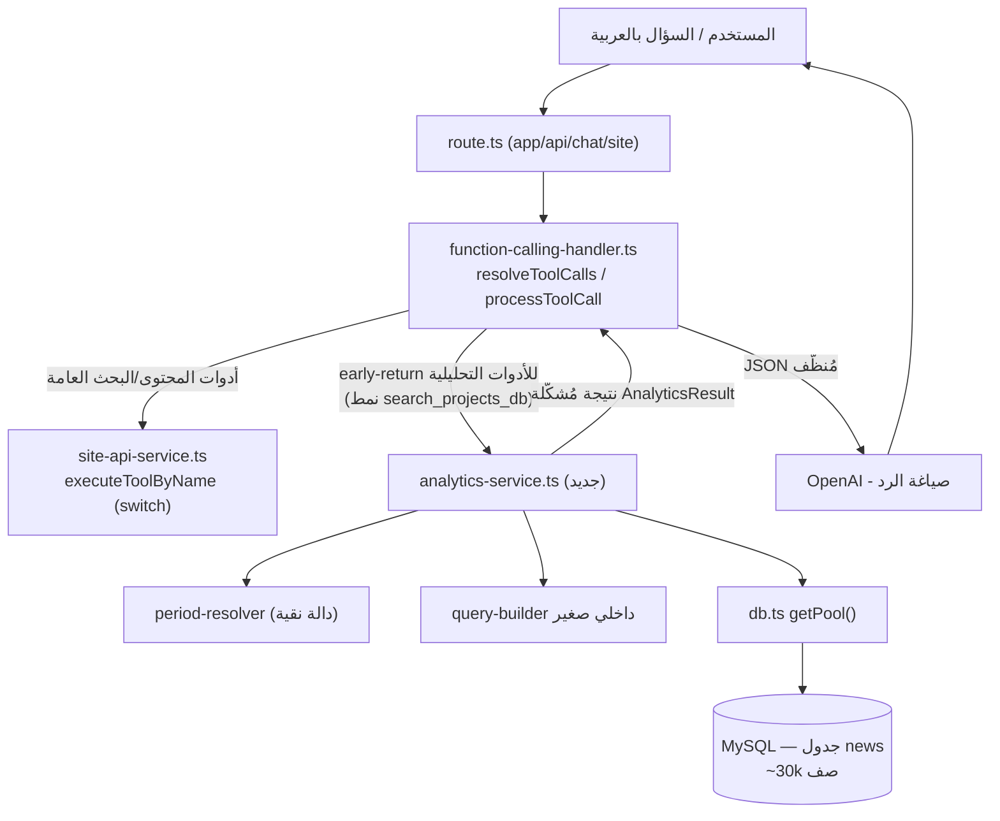

# وثيقة التصميم: أدوات تحليل المحتوى (content-analytics-tools)

## Overview

### نظرة عامة

الهدف من هذه الميزة هو إضافة قدرات **تحليل / رصد / إحصاء** حقيقية فوق بيانات الأخبار (جدول `news`) على شكل **أدوات Function Calling فعلية**، لا على شكل نصوص توجيه في الـ system prompt. المساعد يجب أن يكون قادراً على الإجابة بدقّة على أسئلة مثل:

- «كم مرة ذُكر علي البدري خلال آخر شهر؟» → تكرار ذكر كيان/كلمة ضمن نافذة زمنية.
- «ما أكثر المواضيع تكراراً هذا الأسبوع؟» → اتجاهات (trends).
- «كم خبراً نُشر في قسم X خلال آخر 30 يوماً؟» → عدّ حسب الفترة/التصنيف.
- «أعطني توزيع الذكر شهرياً» → خط زمني (timeline) للذكر.

**القرار المعماري الأساسي:** الوظيفة الحالية للبحث في `news-service.ts` (`getAllNews`) تُحمّل **كل** الأخبار (~30 ألف صف) إلى كاش في الذاكرة ثم تُسجِّل نقاطاً في JavaScript. هذا النهج **غير مناسب للتحليل**: الأعداد تصبح تقريبية/غير دقيقة، والذاكرة تحت ضغط، وحساب `GROUP BY` على الوقت في JS مكلف وغير موثوق. لذلك تنشئ هذه الميزة **وحدة خدمة جديدة مستقلة** `lib/server/analytics-service.ts` تُنفّذ التجميع (aggregation) عبر **SQL معلّم (parameterized)** على جانب قاعدة البيانات: `COUNT`, `GROUP BY`, شرط مدى زمني على `created_at`, ومطابقة `LIKE` على `title + content`.

**مبادئ حاكمة:**
- الدقّة أولاً: العدّ يتم في قاعدة البيانات وليس على كاش جزئي.
- الفصل بين الاهتمامات: مُحلّل الفترات الزمنية (period-resolver) دالة نقية قابلة للاختبار بمعزل عن قاعدة البيانات.
- الأمان: كل قيم المستخدم تُمرَّر كمعاملات (`?`) — لا يوجد إقحام نصّي (string interpolation) لأي مُدخل مستخدم في SQL.
- الصدق في النتائج: النتيجة تحمل بنية كافية (`total`, `matched`, `basis`) ليصوغها المساعد كرقم تقريبي مبني على مطابقة كلمات في العنوان/المحتوى، لا كسجلّ رسمي.
- القابلية للتوسّع: إضافة أداة تحليل جديدة مستقبلاً يجب أن تكون تافهة (أنواع مشتركة + مُحلّل تاريخ مشترك + مُنشئ استعلام صغير).

---

## Architecture

## الجزء الأول: التصميم عالي المستوى (High-Level Design)

### مخطط المكوّنات وتدفّق البيانات



**تدفّق البيانات خطوة بخطوة:**
1. يصل سؤال المستخدم إلى `route.ts` ثم إلى حلقة `resolveToolCalls` في `function-calling-handler.ts`.
2. يختار النموذج أداة تحليلية (مثل `count_mentions`) ويمرّر معاملاتها.
3. `processToolCall` يتعرّف على اسم الأداة التحليلية ويتفرّع مبكراً (early-return) — تماماً كما يفعل مع `search_projects_db` — مستدعياً `analytics-service.ts` مباشرة.
4. داخل `analytics-service.ts`: يُحلّل مواصفة الفترة إلى `{ from, to }` عبر `resolvePeriod` (دالة نقية)، ثم يبني استعلام SQL معلّماً عبر مُنشئ داخلي صغير، ثم ينفّذه عبر `getPool().execute(sql, params)`.
5. تُعاد نتيجة مُشكَّلة (`AnalyticsResult`) تحمل الأعداد والنافذة الزمنية وأساس القياس.
6. `processToolCall` يُسلسل النتيجة إلى JSON (بدون المرور على `cleanProject` لأنها ليست بنية «مشروع») ويعيدها للنموذج ليصوغ الرد.

### حدود الوحدات (Module Boundaries)

| الوحدة | المسؤولية | ما لا تفعله |
|--------|-----------|-------------|
| `analytics-service.ts` (جديد) | التجميع عبر SQL معلّم، تشكيل النتيجة | لا تعرف شيئاً عن OpenAI أو تنسيق الردود |
| `period-resolver` (داخل الخدمة أو ملف مساعد) | تحويل مواصفة الفترة → `{from,to}` بشكل حتمي | لا تلمس قاعدة البيانات |
| `site-tools-definitions.ts` | تعريف مخططات الأدوات + القائمة البيضاء | لا منطق تنفيذ |
| `function-calling-handler.ts` | التوجيه (dispatch) + تنظيف/تسليم JSON | لا SQL |
| `db.ts` | تجمّع الاتصالات + مساعدات نصية | لا منطق تحليل |

**نقطة الالتحام مع خط الأنابيب القائم:** الأدوات التحليلية تُسجَّل في نفس القوائم الموجودة (`ALL_SITE_TOOLS`, `ALLOWED_TOOL_NAMES`, `AllowedToolName`, `isAllowedTool`)، ويتم توجيه تنفيذها عبر فروع early-return في `processToolCall`. هذا يجعل الميزة **قابلة للعكس (reversible)** بالكامل: حذف ملف الخدمة الجديد + إزالة الإدخالات المُضافة يُعيد النظام لحالته السابقة دون آثار جانبية.

---

## Data Models

## الجزء الثاني: التصميم منخفض المستوى (Low-Level Design)

### 1. الأنواع المشتركة وأشكال النتائج (Result Shapes / Types)

```typescript
// ── مواصفة الفترة الزمنية (مُدخل مُوحّد) ──────────────────────────────
// إمّا فترة نسبية (period) أو مدى صريح (from/to بصيغة YYYY-MM-DD).
export interface PeriodSpec {
  period?: "day" | "week" | "month" | "quarter" | "year" | "all"
  lastDays?: number        // «آخر N يوماً» — مثال: 30
  from?: string            // YYYY-MM-DD (مدى صريح)
  to?: string              // YYYY-MM-DD (مدى صريح)
}

// ── نافذة زمنية مُحلّلة جاهزة للـ SQL ──────────────────────────────────
export interface ResolvedWindow {
  from: string | null      // "YYYY-MM-DD 00:00:00" أو null (بلا حدّ سفلي)
  to: string | null        // "YYYY-MM-DD 23:59:59" أو null (بلا حدّ علوي)
  label: string            // وصف بشري: «آخر 30 يوماً»
}

export type Granularity = "day" | "week" | "month"

// ── أساس القياس (للصدق في الصياغة) ────────────────────────────────────
// basis يوضّح للمساعد أن الرقم مبني على مطابقة كلمات، لا سجلّ رسمي.
interface AnalyticsBasis {
  method: "keyword_match"          // مطابقة LIKE على title/content
  fields: ("title" | "content")[]
  note: string                     // نص عربي جاهز يشرح التقريبية
}

// ── نتيجة count_mentions ──────────────────────────────────────────────
export interface CountMentionsResult {
  success: boolean
  data?: {
    query: string
    total: number            // العدد الحقيقي الكامل للمطابقات في النافذة
    window: ResolvedWindow
    basis: AnalyticsBasis
    sample?: Array<{ id: number; title: string; created_at: string; url: string }>
  }
  error?: string
}

// ── نتيجة mentions_timeline ───────────────────────────────────────────
export interface TimelineResult {
  success: boolean
  data?: {
    query: string
    granularity: Granularity
    window: ResolvedWindow
    buckets: Array<{ bucket: string; count: number }>  // مرتّبة تصاعدياً
    total: number
    basis: AnalyticsBasis
  }
  error?: string
}

// ── نتيجة top_topics ──────────────────────────────────────────────────
export interface TopTopicsResult {
  success: boolean
  data?: {
    window: ResolvedWindow
    dimension: "category" | "keyword"
    items: Array<{ label: string; category_id?: number; count: number }>
    basis?: AnalyticsBasis
  }
  error?: string
}

// ── نتيجة count_news ──────────────────────────────────────────────────
export interface CountNewsResult {
  success: boolean
  data?: {
    total: number
    window: ResolvedWindow
    category_id?: number | null
  }
  error?: string
}
```

**ملاحظة على `total`:** اتّساقاً مع النمط القائم في `siteSearch` (حيث `total` = العدد الكامل للمطابقات قبل القصّ)، حقل `total` هنا هو **العدد الحقيقي الكامل** الناتج من `COUNT(*)` في قاعدة البيانات، بينما `sample` مجرّد عيّنة صغيرة اختيارية لدعم الاستشهاد.

### 2. مُحلّل الفترة الزمنية (Period Resolver) — دالة نقية حتمية

منفصلة تماماً عن قاعدة البيانات، حتمية، وقابلة للاختبار بالوحدة. تُصدَّر مستقلة لتُختبر مباشرة.

```typescript
/**
 * يحوّل PeriodSpec إلى نافذة {from, to} بصيغة تواريخ SQL.
 * حتمية: تعتمد على "now" المُمرَّرة (لا تستدعي Date.now داخلياً في الاختبار).
 * - أولوية الحلّ: from/to الصريحة > lastDays > period.
 * - "all" أو غياب كل شيء → {from:null, to:null} (بلا قيود زمنية).
 */
export function resolvePeriod(spec: PeriodSpec, now: Date = new Date()): ResolvedWindow
```

قواعد الحلّ (deterministic):
- `from`/`to` صريحان: يُستخدمان كما هما (from → بداية اليوم `00:00:00`، to → نهاية اليوم `23:59:59`).
- `lastDays = N`: `from = now - N يوماً` (بداية اليوم)، `to = now` (نهاية اليوم). يُقيَّد N ضمن [1, 3650].
- `period`: `day` = اليوم الحالي، `week` = آخر 7 أيام، `month` = آخر 30 يوماً، `quarter` = آخر 90 يوماً، `year` = آخر 365 يوماً.
- تعارض/قيم غير صالحة: تُرمى قيم آمنة افتراضية (شهر) مع تسجيل تحذير — لا رمي استثناء يُعطّل الأداة.
- النافذة الفارغة (from > to): تُعاد `label` توضّح ذلك، والخدمة تُعيد `total: 0` دون تنفيذ استعلام مكلف.

الربط بالتعابير العربية (يتم في طبقة النموذج عبر وصف الأداة، ثم يُترجَم للمعاملات):
- «آخر شهر» → `period:"month"` أو `lastDays:30`.
- «هذا الأسبوع»/«آخر أسبوع» → `period:"week"`.
- «آخر 30 يوماً» → `lastDays:30`.

### 3. تطبيع نص البحث العربي (إعادة استخدام أفكار db.ts)

للمطابقة نعيد استخدام فكرة `normalizeArabicWord` من `db.ts` (إزالة التشكيل والبادئات/اللواحق الشائعة). لكن بما أن المطابقة تتم عبر `LIKE` على جانب قاعدة البيانات، نحتاج تطبيعاً **متوافقاً مع ما هو مخزّن**. الجدول يخزّن نصاً خاماً (HTML للمحتوى)، لذا:

```typescript
/**
 * يبني قائمة أنماط LIKE من عبارة البحث بعد تطبيع خفيف:
 * - إزالة التشكيل والتطويل (ـ).
 * - توحيد الألف والهاء والياء (كما في projects-db normalize).
 * ملاحظة: لا نطبّق تطبيع البادئة "ال" هنا لأن العمود المخزّن غير مطبّع؛
 * التطبيع القويّ يُترك لطبقة LIKE الفضفاضة (%كلمة%).
 */
function buildLikeTerms(query: string): string[]
```

**تقييد مهم:** `LIKE '%...%'` يطابق حرفياً على النص المخزّن غير المطبّع، لذا اختلافات الهمزات/التشكيل قد تُفوّت مطابقات. يُوثَّق هذا في قسم المخاطر، ويُقترح فهرس FULLTEXT كتحسين مستقبلي (انظر قسم الأداء).

## Correctness Properties

خصائص صحّة قابلة للتحقّق (تُشتَقّ منها اختبارات لاحقاً):

### Property 1: حتمية مُحلّل الفترة
لأي `spec` و`now` ثابتة، `resolvePeriod(spec, now)` يُنتج نفس `{from,to}` دائماً (لا عشوائية، لا اعتماد على ساعة داخلية).

### Property 2: انتظام الأعداد الزمنية
لنفس `query` والنافذة، `Σ buckets.count` في `mentionsTimeline` يساوي `total` الناتج من `countMentions` (لا فقدان/ازدواج).

### Property 3: سلامة المعاملات
لكل استعلام، عدد علامات `?` يساوي طول مصفوفة المعاملات المُمرَّرة — لا إقحام نصّي لأي مُدخل مستخدم.

### Property 4: احترام النافذة والرؤية
كل صفّ محسوب يقع ضمن `[from, to]` عند تحديدهما، وكل صفّ محذوف/غير نشط مُستبعَد (`active=1 AND deleted_at IS NULL`).

### Property 5: تقييد الحدود
`limit ∈ [1,20]` و`last_days ∈ [1,3650]` دائماً بعد الـ clamp، مهما كانت قيمة المُدخل.

### Property 6: النافذة الفارغة
إذا `from > to` فالنتيجة `total = 0` دون تنفيذ استعلام.

## Components and Interfaces

### 4. توقيعات دوال `analytics-service.ts` + مخططات SQL معلّمة

```typescript
// جميع الدوال تُعيد أشكال النتائج أعلاه، وتستخدم getPool() من db.ts.

// ── (أ) عدّ الذكر ضمن نافذة زمنية ──────────────────────────────────────
export async function countMentions(params: {
  query: string
  spec: PeriodSpec
  sample?: boolean       // هل نُرجع عيّنة صغيرة؟ (افتراضي false)
}): Promise<CountMentionsResult>
```

مخطّط SQL (معلّم بالكامل — كل `?` قيمة مُمرَّرة):

```sql
-- العدّ الكامل الدقيق
SELECT COUNT(*) AS total
FROM news
WHERE active = 1 AND deleted_at IS NULL
  AND (title LIKE ? OR content LIKE ?)   -- أنماط '%term%' كمعاملات
  AND (? IS NULL OR created_at >= ?)      -- from
  AND (? IS NULL OR created_at <= ?);     -- to

-- عيّنة اختيارية (عند sample=true) — LIMIT ثابت غير مُقحَم من المستخدم
SELECT id, title, created_at
FROM news
WHERE active = 1 AND deleted_at IS NULL
  AND (title LIKE ? OR content LIKE ?)
  AND (? IS NULL OR created_at >= ?)
  AND (? IS NULL OR created_at <= ?)
ORDER BY created_at DESC
LIMIT 5;
```

> ملاحظة أمان: نمط `LIKE` يُبنى في Node كـ `"%" + escapeLike(term) + "%"` ثم يُمرَّر **كقيمة معامل** — لا يُقحَم في نصّ SQL. `escapeLike` يهرّب `%`, `_`, `\`.

```typescript
// ── (ب) الخط الزمني للذكر (اتجاهات) ────────────────────────────────────
export async function mentionsTimeline(params: {
  query: string
  granularity: Granularity   // day | week | month
  spec: PeriodSpec
}): Promise<TimelineResult>
```

مخطّط SQL (التجميع الزمني في قاعدة البيانات — تعبير `DATE_FORMAT` يُختار من enum مُتحقَّق منه، لا من نصّ المستخدم):

```sql
-- الحبيبة (granularity) تُترجَم إلى نمط DATE_FORMAT آمن مُختار من خريطة ثابتة:
--   day   -> '%Y-%m-%d'
--   week  -> '%x-W%v'      (سنة ISO + رقم الأسبوع)
--   month -> '%Y-%m'
SELECT DATE_FORMAT(created_at, ?) AS bucket, COUNT(*) AS count
FROM news
WHERE active = 1 AND deleted_at IS NULL
  AND (title LIKE ? OR content LIKE ?)
  AND (? IS NULL OR created_at >= ?)
  AND (? IS NULL OR created_at <= ?)
GROUP BY bucket
ORDER BY bucket ASC;
```

> نمط `DATE_FORMAT` نفسه يُمرَّر كمعامل، لكن قيمته تأتي حصراً من خريطة ثابتة داخلية `{ day, week, month }` بعد التحقق من الـ enum — لا من مُدخل المستخدم مباشرة.

```typescript
// ── (ج) أكثر المواضيع/الأقسام تكراراً ──────────────────────────────────
export async function topTopics(params: {
  spec: PeriodSpec
  section?: string           // اسم/معرّف تصنيف اختياري
  limit?: number             // افتراضي 5، أقصى 20
}): Promise<TopTopicsResult>
```

بما أن جدول `news` لا يملك جدول تصنيفات مرتبطاً (الاسم يُركَّب حالياً كـ `تصنيف {category_id}`)، فإن البُعد الافتراضي الأدقّ هو **الأقسام الأكثر نشاطاً** عبر `category_id`:

```sql
SELECT category_id, COUNT(*) AS count
FROM news
WHERE active = 1 AND deleted_at IS NULL
  AND (? IS NULL OR created_at >= ?)
  AND (? IS NULL OR created_at <= ?)
GROUP BY category_id
ORDER BY count DESC
LIMIT ?;   -- limit مُقيَّد رقمياً في Node قبل التمرير
```

> «أكثر المواضيع تكراراً» كـ كلمات مفتاحية حرّة يتطلّب NER/استخراج كيانات غير متوفّر (انظر المخاطر)؛ لذا `dimension:"category"` هو السلوك الافتراضي الموثوق، مع ترك الباب مفتوحاً لبُعد `keyword` مستقبلاً (عبر قائمة كلمات مُرشَّحة تُمرَّر للأداة).

```typescript
// ── (د) عدّ الأخبار في فترة/تصنيف (اختياري) ────────────────────────────
export async function countNews(params: {
  spec: PeriodSpec
  categoryId?: number
}): Promise<CountNewsResult>
```

```sql
SELECT COUNT(*) AS total
FROM news
WHERE active = 1 AND deleted_at IS NULL
  AND (? IS NULL OR category_id = ?)
  AND (? IS NULL OR created_at >= ?)
  AND (? IS NULL OR created_at <= ?);
```

### 5. مُنشئ الاستعلام الداخلي المشترك (Extensibility)

لتفادي التكرار وجعل إضافة أدوات جديدة تافهة، نستخرج بناء شرط النافذة الزمنية والمطابقة في مساعد داخلي صغير:

```typescript
/** يبني جزء WHERE للنافذة الزمنية + معاملاتها بشكل متّسق عبر كل الاستعلامات. */
function windowClause(w: ResolvedWindow): { sql: string; params: (string | null)[] }
// يُعيد: { sql: "AND (? IS NULL OR created_at >= ?) AND (? IS NULL OR created_at <= ?)",
//          params: [w.from, w.from, w.to, w.to] }

/** يبني جزء المطابقة على title/content + معاملاته. */
function matchClause(query: string): { sql: string; params: string[] }
// يُعيد: { sql: "AND (title LIKE ? OR content LIKE ?)", params: [like, like] }
```

هذا يجعل أي أداة تحليلية مستقبلية مجرّد تركيب `SELECT ... FROM news WHERE base ${windowClause} ${matchClause}`.

### 6. مخططات الأدوات (Tool Schemas) — في `site-tools-definitions.ts`

```typescript
export const TOOL_COUNT_MENTIONS: ChatCompletionTool = {
  type: "function",
  function: {
    name: "count_mentions",
    description: "عدّ عدد مرات ذكر كلمة أو اسم أو موضوع في أخبار شبكة الكفيل ضمن فترة زمنية. استخدمها لأسئلة مثل: «كم مرة ذُكر علي البدري خلال آخر شهر؟»، «كم خبراً تحدّث عن الأربعين هذا الأسبوع؟». العدّ تقريبي مبني على مطابقة الكلمة في العنوان والمحتوى.",
    parameters: {
      type: "object",
      properties: {
        query: { type: "string", description: "الكلمة أو الاسم أو الموضوع المراد عدّ ذكره (بالعربية)" },
        period: { type: "string", description: "الفترة النسبية", enum: ["day", "week", "month", "quarter", "year", "all"] },
        last_days: { type: "number", description: "عدد الأيام الأخيرة (مثال: 30). يُستخدم بدل period عند الحاجة", minimum: 1, maximum: 3650 },
        from: { type: "string", description: "بداية المدى الصريح بصيغة YYYY-MM-DD (اختياري)" },
        to: { type: "string", description: "نهاية المدى الصريح بصيغة YYYY-MM-DD (اختياري)" }
      },
      required: ["query"]
    }
  }
}

export const TOOL_MENTIONS_TIMELINE: ChatCompletionTool = {
  type: "function",
  function: {
    name: "mentions_timeline",
    description: "توزيع زمني (خط زمني) لعدد مرات ذكر كلمة/موضوع عبر أيام أو أسابيع أو أشهر — لرصد الاتجاهات. استخدمها لأسئلة مثل: «كيف تطوّر ذكر الزيارة الأربعينية شهرياً؟».",
    parameters: {
      type: "object",
      properties: {
        query: { type: "string", description: "الكلمة أو الموضوع (بالعربية)" },
        granularity: { type: "string", description: "حبيبة التجميع الزمني", enum: ["day", "week", "month"] },
        period: { type: "string", enum: ["week", "month", "quarter", "year", "all"] },
        last_days: { type: "number", minimum: 1, maximum: 3650 },
        from: { type: "string", description: "YYYY-MM-DD (اختياري)" },
        to: { type: "string", description: "YYYY-MM-DD (اختياري)" }
      },
      required: ["query", "granularity"]
    }
  }
}

export const TOOL_TOP_TOPICS: ChatCompletionTool = {
  type: "function",
  function: {
    name: "top_topics",
    description: "أكثر الأقسام/التصنيفات نشاطاً (عدد الأخبار) خلال فترة زمنية. استخدمها لأسئلة مثل: «ما أكثر الأقسام نشراً هذا الأسبوع؟».",
    parameters: {
      type: "object",
      properties: {
        period: { type: "string", enum: ["day", "week", "month", "quarter", "year", "all"] },
        last_days: { type: "number", minimum: 1, maximum: 3650 },
        section: { type: "string", description: "اسم أو معرّف تصنيف للتصفية (اختياري)" },
        limit: { type: "number", description: "عدد النتائج (افتراضي 5، أقصى 20)", minimum: 1, maximum: 20 }
      },
      required: []
    }
  }
}

export const TOOL_COUNT_NEWS: ChatCompletionTool = {
  type: "function",
  function: {
    name: "count_news",
    description: "عدّ الأخبار المنشورة ضمن فترة زمنية و/أو تصنيف محدّد. استخدمها لأسئلة مثل: «كم خبراً نُشر في قسم X خلال آخر 30 يوماً؟».",
    parameters: {
      type: "object",
      properties: {
        category_id: { type: "number", description: "معرّف التصنيف (اختياري)" },
        period: { type: "string", enum: ["day", "week", "month", "quarter", "year", "all"] },
        last_days: { type: "number", minimum: 1, maximum: 3650 },
        from: { type: "string", description: "YYYY-MM-DD (اختياري)" },
        to: { type: "string", description: "YYYY-MM-DD (اختياري)" }
      },
      required: []
    }
  }
}
```

### 7. تغييرات الربط لكل ملف (Wiring Changes)

**`lib/server/site-tools-definitions.ts`:**
- إضافة الثوابت الأربعة أعلاه.
- إضافتها إلى مصفوفة `ALL_SITE_TOOLS`.
- إضافة أسمائها إلى `ALLOWED_TOOL_NAMES` (وبالتالي تُشتقّ تلقائياً في `AllowedToolName` وتُقبل في `isAllowedTool`).

```typescript
export const ALL_SITE_TOOLS: ChatCompletionTool[] = [
  /* ...الموجود... */,
  TOOL_COUNT_MENTIONS, TOOL_MENTIONS_TIMELINE, TOOL_TOP_TOPICS, TOOL_COUNT_NEWS
]

export const ALLOWED_TOOL_NAMES = [
  /* ...الموجود... */,
  "count_mentions", "mentions_timeline", "top_topics", "count_news"
] as const
```

**`lib/server/function-calling-handler.ts`:** إضافة فروع early-return في `processToolCall` (بعد فرع `search_projects_db` وقبل استدعاء `executeToolByName`)، اتّساقاً مع النمط القائم للأدوات المرتبطة بقاعدة بيانات مخصّصة:

```typescript
import {
  countMentions, mentionsTimeline, topTopics, countNews
} from "./analytics-service"

// داخل processToolCall، بعد التحقق من الـ whitelist وتحليل args:
if (toolName === "count_mentions") {
  const r = await countMentions({
    query: args.query || "",
    spec: { period: args.period, lastDays: args.last_days, from: args.from, to: args.to },
    sample: true
  })
  return { tool_call_id: toolCallId, role: "tool",
    content: JSON.stringify(r.success ? r.data : { success: false, message: r.error }) }
}

if (toolName === "mentions_timeline") {
  const r = await mentionsTimeline({
    query: args.query || "",
    granularity: args.granularity,
    spec: { period: args.period, lastDays: args.last_days, from: args.from, to: args.to }
  })
  return { tool_call_id: toolCallId, role: "tool",
    content: JSON.stringify(r.success ? r.data : { success: false, message: r.error }) }
}

if (toolName === "top_topics") {
  const r = await topTopics({
    spec: { period: args.period, lastDays: args.last_days },
    section: args.section, limit: args.limit
  })
  return { tool_call_id: toolCallId, role: "tool",
    content: JSON.stringify(r.success ? r.data : { success: false, message: r.error }) }
}

if (toolName === "count_news") {
  const r = await countNews({
    spec: { period: args.period, lastDays: args.last_days, from: args.from, to: args.to },
    categoryId: args.category_id
  })
  return { tool_call_id: toolCallId, role: "tool",
    content: JSON.stringify(r.success ? r.data : { success: false, message: r.error }) }
}
```

**أين يتم التنظيف/التنسيق لـ GPT:** نتائج التحليل بنى إحصائية (أعداد ونوافذ)، وليست بنى «مشروع»؛ لذا يجب أن **تتجاوز** `cleanResultForGPT`/`cleanProject` (التي تُسقط حقولاً مثل الأعداد وتفترض `id`/`name`). التمرير المباشر عبر `JSON.stringify` في فرع الـ early-return هو الصحيح — نفس أسلوب `search_projects_db`. لا حاجة لإضافتها إلى `PASSTHROUGH_TOOLS` لأن مسار `executeToolByName` لن يُطالها أصلاً.

> **لماذا early-return بدل switch في `executeToolByName`؟** لأن أشكال نتائج التحليل تختلف جوهرياً عن `APICallResult` المُوجَّه لـ `cleanResultForGPT`. الـ early-return يمنحنا تحكماً كاملاً بالتسلسل ويتجنّب فقدان الأعداد أثناء التنظيف — وهو النمط الأنظف والمُوصى به هنا، ومطابق لـ `search_projects_db`.

## Error Handling

### 8. معالجة الأخطاء

| السيناريو | المعالجة | الرد للمستخدم عبر النموذج |
|-----------|----------|--------------------------|
| فشل الاتصال بقاعدة البيانات | `catch` يُعيد `{success:false, error}` (نمط الخدمات القائم) | «تعذّر الوصول لقاعدة البيانات» |
| `granularity` خارج enum | يُرفض قبل SQL، افتراضي `month` مع تحذير | يُكمل بالحبيبة الافتراضية |
| نافذة فارغة (from > to) | إرجاع `total:0` دون تنفيذ استعلام | «لا توجد أخبار في هذه الفترة» |
| `query` فارغ في count_mentions | إرجاع خطأ واضح `{success:false}` | طلب توضيح الكلمة المراد عدّها |
| `limit`/`last_days` تجاوز الحدّ | يُقيَّد رقمياً (clamp) قبل التمرير | شفّاف للمستخدم |

### 9. مثال استخدام (Example Usage)

```typescript
// «كم مرة ذُكر علي البدري خلال آخر شهر؟»
const r = await countMentions({ query: "علي البدري", spec: { period: "month" }, sample: true })
// r.data = {
//   query: "علي البدري", total: 12,
//   window: { from: "2024-05-10 00:00:00", to: "2024-06-09 23:59:59", label: "آخر 30 يوماً" },
//   basis: { method: "keyword_match", fields: ["title","content"],
//            note: "رقم تقريبي مبني على مطابقة الكلمة في عناوين ومحتوى الأخبار" },
//   sample: [ { id: 98213, title: "...", created_at: "...", url: "https://alkafeel.net/news/index.php?id=98213" } ]
// }

// «توزيع الذكر شهرياً»
await mentionsTimeline({ query: "الأربعين", granularity: "month", spec: { period: "year" } })
// buckets: [ { bucket: "2024-01", count: 8 }, { bucket: "2024-02", count: 15 }, ... ]
```

---

## الأداء والفهرسة (Performance & Indexing)

- **فهرس على `created_at`:** كل الاستعلامات تُرشّح على مدى زمني. يُوصى بإضافة فهرس:
  `CREATE INDEX idx_news_created_at ON news (created_at);`
  ويفضّل فهرس مركّب يخدم الترشيح الشائع: `(active, deleted_at, created_at)` لتسريع شرط الأساس + النافذة معاً.
- **`LIKE '%...%'` مقابل FULLTEXT للعربية:**
  - `LIKE '%term%'` (البادئة بـ `%`) **لا يستفيد من الفهارس** ويُجري مسحاً كاملاً — مقبول على ~30k صف لكنه يتدهور مع النمو.
  - `FULLTEXT` أسرع بكثير لكنه يعتمد على تقسيم الكلمات (tokenizer)؛ والعربية إشكالية: التشكيل، الهمزات، «ال» التعريف، واللواحق تُنتج رموزاً (tokens) لا تتطابق بدقّة. `ngram parser` يُخفّف ذلك جزئياً على حساب حجم الفهرس.
  - **التوصية:** البدء بـ `LIKE` (بسيط ودقيق نسبياً على الحجم الحالي)، مع توثيق FULLTEXT + `ngram` كترقية مستقبلية عند نمو الجدول، وربما عمود مُطبّع مسبقاً (`title_norm`) يُملأ عند الكتابة لتحسين المطابقة.
- **الكاش:** التحليل يحتاج **دقّة**، لا كاشاً؛ لذا لا يستخدم `newsCache`. يمكن مستقبلاً إضافة كاش قصير (60 ثانية) لنتائج `top_topics`/`count_news` الشائعة (بمفتاح = النافذة + التصنيف) لأنها لا تعتمد على نصّ حرّ.
- **الحدود (caps):** `LIMIT` ثابت في العيّنات (5)، و`limit` في `top_topics` مُقيَّد ضمن [1,20] لمنع نتائج ضخمة.

---

## ملاحظات الأمان (Security)

- **استعلامات معلّمة حصراً:** كل قيم المستخدم (`query`, `from`, `to`, `category_id`, `limit`, نمط `LIKE`, نمط `DATE_FORMAT`) تُمرَّر عبر `db.execute(sql, params)` كمعاملات `?`. **لا يوجد** إقحام نصّي لأي مُدخل مستخدم في SQL — هذه قاعدة صارمة تُبرَز هنا لأن الكود الحالي يعتمد النمط ذاته (`db.execute(sql, [..])`).
- **تهريب `LIKE`:** أنماط `LIKE` تُبنى كـ `"%" + escapeLike(term) + "%"` حيث يهرّب `escapeLike` المحارف `%`, `_`, `\` لمنع wildcard injection.
- **قوائم بيضاء للـ enum:** `granularity` و`period` يُتحقَّق منهما مقابل قيم ثابتة قبل استخدامهما لاختيار نمط `DATE_FORMAT` من خريطة داخلية — لا يصل نصّ المستخدم إلى بنية SQL إطلاقاً.
- **تقييد المدى:** `last_days` ضمن [1,3650]، و`limit` ضمن [1,20] (clamp) لمنع استعلامات مكلفة أو نتائج ضخمة.
- **احترام الرؤية:** كل الاستعلامات تُقيّد بـ `active = 1 AND deleted_at IS NULL` كي لا تُحصى الأخبار المحذوفة/غير المنشورة.

---

## المخاطر والمقايضات (Risks & Tradeoffs)

1. **دقّة المطابقة العربية:** `LIKE` حرفي على نصّ غير مطبّع → قد يُفوّت مطابقات بسبب الهمزات/التشكيل، أو يُنتج مطابقات زائدة (كلمة ضمن كلمة أطول). النتيجة **تقريبية** بطبيعتها.
2. **الكيان مقابل الكلمة المفتاحية (لا NER):** «علي البدري» تُعامَل كسلسلة نصّية، لا ككيان مُعرَّف. تشابه الأسماء أو ورودها في سياقات مختلفة قد يُضخّم/يُقلّل العدّ. لا يوجد استخراج كيانات (NER).
3. **المحتوى HTML:** `content` يحتوي وسوم HTML؛ `LIKE` قد يطابق نصّاً داخل سمات/روابط نادراً. الأثر محدود لكنه قائم.
4. **«أكثر المواضيع» بلا تصنيف موضوعي:** غياب جدول تصنيفات موضوعي يجعل `top_topics` يعتمد على `category_id` (نشاط الأقسام) لا المواضيع الدلالية.

**كيف يصوغ المساعد النتيجة (الصدق):** يستخدم حقل `basis.note` ليقدّم الرقم كـ **«رقم تقريبي مبني على مطابقة الكلمة في عناوين ومحتوى الأخبار خلال [النافذة]»**، لا كإحصاء رسمي، مع ذكر النافذة الزمنية صراحةً. هذا يعيد استخدام النمط الذي كرّسناه حيث `total` = العدد الحقيقي للمطابقات، مع توضيح أساس القياس.

---

## Testing Strategy

### استراتيجية الاختبار

**اختبارات الوحدة (حتمية، بلا قاعدة بيانات):**
- `resolvePeriod`: تُختبر مباشرة بتمرير `now` ثابتة والتحقق من `{from,to,label}` لكل حالة: `day/week/month/quarter/year/all`, `lastDays`, `from/to` صريحة، تعارض القيم، والنافذة الفارغة، وتقييد الحدود. أداة الاختبار: **Jest** (موجودة أصلاً في `jest.config.js` و`lib/server/__tests__`).
- `buildLikeTerms` و`escapeLike`: التحقق من التطبيع وتهريب `% _ \`.
- `windowClause`/`matchClause`: التحقق من تطابق عدد `?` مع طول مصفوفة المعاملات (ضمان معاملات صحيحة).
- خريطة `granularity → DATE_FORMAT`: التحقق من رفض القيم خارج الـ enum.

**اعتبارات التكامل (تعتمد على قاعدة بيانات):**
- اختبارات SQL الفعلية (`countMentions`, `mentionsTimeline`, ...) تتطلّب اتصال MySQL؛ تُوسَم كاختبارات تكامل تعتمد قاعدة بيانات وتُشغَّل مقابل قاعدة اختبار (أو نسخة مصغّرة). يمكن استخدام mock للـ pool للتحقق من نصّ SQL المُولَّد ومصفوفة المعاملات دون تنفيذ فعلي.
- اختبار انتظام الأعداد: التحقق أن `sum(buckets.count) === total` في `mentionsTimeline` لنفس النافذة والاستعلام.

**نقاط تحقق إضافية:** التأكد أن الأدوات مُدرَجة في `ALLOWED_TOOL_NAMES` وأن `isAllowedTool` يقبلها، وأن فروع `processToolCall` تُعيد JSON صالحاً (يمكن الاستفادة من `function-calling-handler.test.ts` القائم كنموذج).

---

## الاعتماديات (Dependencies)

- **لا اعتماديات جديدة.** الميزة تعيد استخدام: `mysql2/promise` (عبر `getPool()` في `db.ts`)، `openai` (أنواع `ChatCompletionTool`)، و`Jest` للاختبار — جميعها موجودة في المشروع.
- تغيير قاعدة بيانات مُوصى به (غير حاصر): إضافة فهرس `idx_news_created_at` (وربما المركّب) لتحسين الأداء.

---

## قابلية العكس (Reversibility)

الميزة معزولة: ملف خدمة جديد واحد + إدخالات مُضافة في ملفَّي التعريف والتوجيه. لا تعديل على منطق `getAllNews`/الكاش القائم ولا على مسارات الأدوات الأخرى. التراجع = حذف `analytics-service.ts` وإزالة الإدخالات الأربعة والفروع الأربعة.
