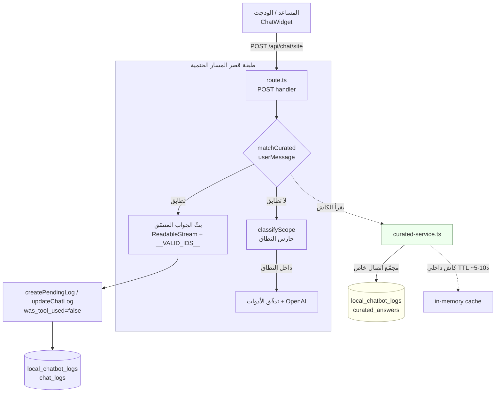
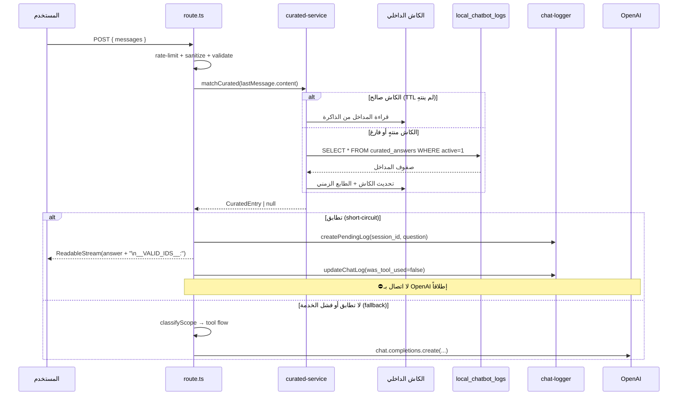

# وثيقة التصميم: مخزن الإجابات المنسّقة (curated-answers-store)

## Overview
## 1. نظرة عامة والأهداف

### الغرض

استبدال مصدرين متفرّقين للإجابات الموثوقة بمصدر واحد قابل للإدارة ومدعوم بقاعدة البيانات:

1. **مصفوفة الأسئلة الشائعة الثابتة** في `lib/server/faq.ts` (`FAQ_ENTRIES`) التي تُفحص عبر `searchFAQ()` قبل استدعاء OpenAI.
2. **استثناء صلاة التراويح** المضمّن حالياً كنصّ داخل `SITE_BOT_SYSTEM_PROMPT` في `lib/server/system-prompts.ts` (كتلة «⛔ استثناء ثابت — صلاة التراويح»).

يُدمج الاثنان في مخزن واحد اسمه `curated_answers` داخل قاعدة سجلّات معزولة (`local_chatbot_logs`)، تخدمه طبقة خدمة جديدة `lib/server/curated-service.ts`. عند تطابق رسالة المستخدم مع مدخلة منسّقة، يُقصَّر المسار (short-circuit) ويُعاد الجواب الموثوق **قبل** أي اتصال بـ OpenAI.

### الأهداف

- **حتمية (Deterministic):** نفس المدخل ينتج نفس الجواب دائماً، بلا عشوائية النموذج اللغوي.
- **صفر تسريب من النموذج (Zero LLM leakage):** الإجابات المنسّقة لا تمرّ عبر OpenAI إطلاقاً.
- **بلا تضخّم للـ prompt:** إخراج موقف التراويح من الـ system prompt يقلّص حجمه ويحافظ على القاعدة العامة «السرد والشرح من النتائج حصراً».
- **قابلية التحرير بلا إعادة نشر:** تُدار المداخل من صفوف قاعدة البيانات لا من الكود المصدري.
- **إضافي بالكامل وقابل للعكس (Additive & Reversible):** جدول واحد جديد عبر `CREATE TABLE IF NOT EXISTS`، بلا `ALTER`/`DROP`، وبلا مساس ببيانات المحتوى (`ka_db` / `alkafeel_projects`).
- **تدهور آمن (Graceful degradation):** إن تعذّر تحميل المخزن (قاعدة السجلّات معطّلة) يستمرّ المسار الطبيعي إلى تدفّق الأدوات، بلا انهيار.

### القيود المُلزِمة (من طلب المستخدم)

| # | القيد | الأثر على التصميم |
|---|-------|-------------------|
| C1 | إضافي فقط | جدول `curated_answers` واحد جديد في `local_chatbot_logs` عبر `CREATE TABLE IF NOT EXISTS`. لا `ALTER`/`DROP`. |
| C2 | عدم المساس ببيانات المحتوى | الخدمة تستخدم مجمّع اتصال خاصاً بها (نمط `chat-logger.ts`)، **لا** `getPool()` الخاص بالمحتوى. |
| C3 | نقل موقف التراويح إلى صفّ بذرة | حذف كتلة استثناء التراويح من `system-prompts.ts` مع الإبقاء على القاعدة العامة. |
| C4 | تدهور آمن | كل استدعاء للمخزن داخل `try/catch`؛ الفشل ⇒ المتابعة لا الانهيار. |

---

## Architecture
## 2. التصميم عالي المستوى (High-Level Design)

### 2.1 مخطط المكوّنات



### 2.2 تدفّق البيانات



### 2.3 نقطة الإدماج الدقيقة (Plug-in Point)

في `app/api/chat/site/route.ts`، تُستبدل كتلة **«فحص FAQ الثابت أولاً»** الحالية (التي تستدعي `searchFAQ`) باستدعاء غير متزامن `matchCurated`. النقطة نفسها محفوظة تماماً:

- **الموضع:** بعد التنظيف والتحقق (`sanitizedMessages` / `validation`)، و**قبل** حارس النطاق `classifyScope` وقبل تدفّق الأدوات.
- **السلوك المحفوظ حرفياً:** `createPendingLog` → `ReadableStream` يبثّ نصّ الجواب ثم `\n__VALID_IDS__:` ثم `close()` → `updateChatLog(was_tool_used=false)` → `Response` بترويسات `securityHeaders` + `Content-Type: text/plain; charset=utf-8` + `X-Chat-Log-Id`.
- **الفرق الوحيد:** `searchFAQ` كانت متزامنة؛ `matchCurated` غير متزامنة (تقرأ الكاش/قاعدة البيانات) ومغلّفة بـ `try/catch` للتدهور الآمن.

### 2.4 حدود الوحدات (Module Boundaries)

| الوحدة | المسؤولية | ما لا تفعله |
|--------|-----------|-------------|
| `route.ts` | التنسيق: يستدعي `matchCurated`، يبثّ، يسجّل، يتدهور بأمان | لا يعرف بنية قاعدة البيانات ولا صياغة SQL |
| `curated-service.ts` | المجمّع الخاص، `ensureTable`، `seed`, الكاش، `matchCurated` | لا يبثّ ولا يعرف بترويسات HTTP |
| `faq.ts` | مصدر بذرة فقط: `FAQ_ENTRIES` + `normalizeArabic` | يُلغى `searchFAQ` من مسار route (يبقى للاختبار/البذرة) |
| `chat-logger.ts` | التسجيل في `chat_logs` — دون تغيير | — |
| `system-prompts.ts` | القواعد العامة — بعد حذف كتلة التراويح | لم يعد يحمل موقف التراويح |

---

## 3. التصميم منخفض المستوى (Low-Level Design)

اللغة: **TypeScript** (مطابقة للكود القائم، الملفات كلها `.ts`).

## Data Models

### 3.1 تعريف جدول `curated_answers` (DDL)

```sql
CREATE TABLE IF NOT EXISTS curated_answers (
  id          BIGINT UNSIGNED AUTO_INCREMENT PRIMARY KEY,
  category    ENUM('faq','stance') NOT NULL DEFAULT 'faq',
  patterns    TEXT NOT NULL,                        -- JSON array of strings: ["نمط1","نمط2"]
  answer      TEXT NOT NULL,
  url         VARCHAR(512) NULL,
  mode        VARCHAR(32) NOT NULL DEFAULT 'short_circuit',
  priority    INT NOT NULL DEFAULT 0,
  active      TINYINT(1) NOT NULL DEFAULT 1,
  note        TEXT NULL,
  created_at  DATETIME DEFAULT CURRENT_TIMESTAMP,
  updated_at  DATETIME DEFAULT CURRENT_TIMESTAMP ON UPDATE CURRENT_TIMESTAMP,
  INDEX idx_active_priority (active, priority),
  INDEX idx_category (category)
) ENGINE=InnoDB DEFAULT CHARSET=utf8mb4 COLLATE=utf8mb4_unicode_ci;
```

**تبرير الحقول:**

| الحقل | النوع | التبرير |
|-------|-------|---------|
| `id` | `BIGINT UNSIGNED AI PK` | يطابق نمط `chat_logs` في `chat-logger.ts`. |
| `category` | `ENUM('faq','stance')` | يفصل الأسئلة الشائعة عن المواقف الفقهية (كالتراويح) لأغراض الإدارة والتقارير، دون جدولين. |
| `patterns` | `TEXT` (مصفوفة JSON نصّية) | يطابق دلالة `patterns: string[]` في `FAQEntry`. مصفوفة JSON لتبقى قابلة للقراءة/التحرير يدوياً، وتُحلَّل عبر `JSON.parse` عند التحميل. تفشل بأمان (تُتجاهل المدخلة إن كان الحقل غير صالح). |
| `answer` | `TEXT` | الجواب الكامل الجاهز — يطابق `FAQEntry.answer`. |
| `url` | `VARCHAR(512) NULL` | رابط المصدر الاختياري — يطابق `FAQEntry.url`. |
| `mode` | `VARCHAR(32)` افتراضي `short_circuit` | يمهّد لأوضاع مستقبلية (مثل `augment_prompt`) دون تغيير المخطط الآن. |
| `priority` | `INT` افتراضي `0` | يحدّد ترتيب المطابقة عند تداخل الأنماط؛ الأعلى أولاً (يخدم الحتمية). |
| `active` | `TINYINT(1)` افتراضي `1` | تعطيل/تفعيل بلا حذف — يحافظ على القابلية للعكس والإدارة. |
| `note` | `TEXT NULL` | ملاحظة إدارية داخلية (سبب الموقف، مرجع البحث المنشور للتراويح...). |
| `created_at`/`updated_at` | `DATETIME` | تتبّع زمني، يطابق نمط الجداول القائمة. |
| `idx_active_priority` | فهرس | يسرّع `WHERE active=1 ORDER BY priority DESC`. |

## Components and Interfaces

### 3.2 `lib/server/curated-service.ts`

#### النوع `CuratedEntry`

```typescript
export interface CuratedEntry {
  id: number
  category: 'faq' | 'stance'
  patterns: string[]      // مُحلَّلة من JSON
  answer: string
  url?: string | null
  mode: string            // 'short_circuit'
  priority: number
  active: boolean
}
```

#### المجمّع الخاص (نمط `chat-logger.ts`)

```typescript
import mysql from "mysql2/promise"
import { getDatabaseConfig } from "./site-api-config"

let pool: mysql.Pool | null = null

function getPool(): mysql.Pool {
  if (pool) return pool
  const cfg = getDatabaseConfig()
  pool = mysql.createPool({
    host: cfg.host,
    port: cfg.port,
    user: cfg.user,
    password: cfg.password,
    // نفس قاعدة السجلّات المعزولة المستخدمة في chat-logger.ts
    database: process.env.LOGS_DB_NAME || process.env.PROJECTS_DB_NAME || cfg.database || "local_chatbot_logs",
    connectionLimit: 3,
    charset: "utf8mb4",
    socketPath: process.env.DB_SOCKET || undefined,
  })
  return pool
}
```

#### `ensureTable()`

```typescript
let tableReady = false

async function ensureTable(): Promise<void> {
  if (tableReady) return
  const db = getPool()
  await db.execute(`CREATE TABLE IF NOT EXISTS curated_answers ( ... )`) // DDL أعلاه
  tableReady = true
}
```

#### `seed()` — بذرة idempotent

```typescript
// يبذر FAQ_ENTRIES + موقف التراويح فقط إذا كان الجدول فارغاً (idempotent)
export async function seed(): Promise<void> {
  await ensureTable()
  const db = getPool()
  const [rows] = await db.execute(`SELECT COUNT(*) AS n FROM curated_answers`) as any
  if (rows[0].n > 0) return   // مبذور مسبقاً → لا شيء

  // 1) بذرة الأسئلة الشائعة من faq.ts (المصدر الوحيد للحقيقة عند البذر)
  for (const e of FAQ_ENTRIES) {
    await db.execute(
      `INSERT INTO curated_answers (category, patterns, answer, url, priority)
       VALUES ('faq', ?, ?, ?, 0)`,
      [JSON.stringify(e.patterns), e.answer, e.url ?? null]
    )
  }

  // 2) بذرة موقف التراويح (المنقول من system-prompts.ts) — أولوية أعلى
  await db.execute(
    `INSERT INTO curated_answers (category, patterns, answer, url, priority, note)
     VALUES ('stance', ?, ?, NULL, 10, ?)`,
    [
      JSON.stringify(["التراويح", "صلاة التراويح", "تراويح"]),
      "صلاة التراويح (جماعةً) غير مُقرّة لدى العتبة العباسية المقدسة وتُعدّ بدعة، وثمة بحث منشور في ذلك ضمن محتوى الموقع...",
      "منقول من كتلة استثناء system-prompts.ts"
    ]
  )
}
```

> ملاحظة: بذرة التراويح أولويتها `10` (> أولوية الأسئلة الشائعة `0`) لأنها موقف حسّاس يجب أن يُقصّر المسار قبل أي تطابق أعمّ.

#### الكاش الداخلي مع TTL

```typescript
let cache: CuratedEntry[] | null = null
let cacheLoadedAt = 0
const CACHE_TTL_MS = 5 * 60 * 1000   // 5 دقائق (قابل للضبط حتى 10)

async function loadEntries(): Promise<CuratedEntry[]> {
  const now = Date.now()
  if (cache && (now - cacheLoadedAt) < CACHE_TTL_MS) return cache

  await ensureTable()
  const db = getPool()
  const [rows] = await db.execute(
    `SELECT id, category, patterns, answer, url, mode, priority, active
     FROM curated_answers
     WHERE active = 1
     ORDER BY priority DESC, id ASC`
  ) as any

  cache = rows.map(mapRow).filter(Boolean) as CuratedEntry[]  // JSON.parse فاشل ⇒ تُتجاهل المدخلة
  cacheLoadedAt = now
  return cache
}
```

#### `matchCurated(userMessage)` — إعادة استخدام تطبيع faq.ts

```typescript
import { normalizeArabic } from "./faq"   // يُصدَّر normalizeArabic من faq.ts

const MIN_LENGTH = 5   // نفس حارس الطول في searchFAQ الأصلية

export async function matchCurated(userMessage: string): Promise<CuratedEntry | null> {
  const q = normalizeArabic(userMessage)
  if (!q || q.length < MIN_LENGTH) return null   // تجاهل الرسائل القصيرة جداً

  const entries = await loadEntries()   // مرتّبة تنازلياً حسب priority

  for (const entry of entries) {        // أعلى أولوية أولاً ⇒ حتمية
    for (const pattern of entry.patterns) {
      const p = normalizeArabic(pattern)
      // تطابق حدود الكلمة (word-boundary) — نفس منطق faq.ts
      const regex = new RegExp(`(^|\\s)${p.replace(/[.*+?^${}()|[\]\\]/g, '\\$&')}($|\\s)`)
      if (regex.test(q)) return entry
    }
  }
  return null
}
```

**الترتيب والحتمية:** `ORDER BY priority DESC, id ASC` يضمن ترتيباً مستقراً ونهائياً؛ لا اعتماد على ترتيب إدراج غير محدّد. عند تساوي الأولوية يفصل `id`.

**تغيير مطلوب في `faq.ts`:** تصدير `normalizeArabic` (كانت خاصة) لإعادة استخدامها دون تكرار المنطق:

```typescript
export function normalizeArabic(text: string): string { /* بلا تغيير */ }
```

### 3.3 ربط `route.ts`

استبدال كتلة FAQ الحالية بالآتي (مع الحفاظ التامّ على البثّ/التسجيل/الترويسات):

```typescript
import { matchCurated } from "@/lib/server/curated-service"
// (يُحذف) import { searchFAQ } from "@/lib/server/faq"

// ===== فحص المخزن المنسّق أولاً (بديل searchFAQ) =====
if (lastMessage.role === "user") {
  let curated = null
  try {
    curated = await matchCurated(lastMessage.content)   // C4: تدهور آمن
  } catch (err) {
    console.error("[Curated] match failed, continuing pipeline:", err)
    curated = null   // فشل الخدمة ⇒ المتابعة للمسار الطبيعي
  }

  if (curated) {
    console.log(`[Chat API] Curated hit (${curated.category}) for: "${lastMessage.content.slice(0, 60)}"`)
    const text = curated.url
      ? `${curated.answer}\n\n📖 *المصدر* — 🔗 [اقرأ المزيد](${curated.url})`
      : curated.answer

    const logId = await createPendingLog(session_id, lastMessage.content)
    const encoder = new TextEncoder()
    const stream = new ReadableStream({
      start(controller) {
        controller.enqueue(encoder.encode(text))
        controller.enqueue(encoder.encode(`\n__VALID_IDS__:`))
        controller.close()
        if (logId) {
          updateChatLog(logId, {
            finalAnswer: text,
            responseTimeMs: Date.now() - startMs,
            wasToolUsed: false,
          }).catch(err => console.error("[ChatLogger]", err))
        }
      }
    })
    return new Response(stream, {
      headers: {
        ...securityHeaders,
        "Content-Type": "text/plain; charset=utf-8",
        "X-Chat-Log-Id": logId || "",
      }
    })
  }
}
// ... يليه حارس النطاق classifyScope كما هو ...
```

**نقاط حرجة محفوظة:**
- تبقى الكتلة **قبل** `classifyScope` وقبل تدفّق الأدوات.
- نفس صيغة الترويسات والبثّ (`\n__VALID_IDS__:` فارغة لأن المصدر ليس نتيجة أداة).
- `was_tool_used=false` كما في مسار FAQ الأصلي.
- `try/catch` حول `matchCurated` فقط؛ الفشل يترك `curated=null` ⇒ يسقط التنفيذ طبيعياً إلى حارس النطاق ثم الأدوات.

### 3.4 حذف كتلة التراويح من `system-prompts.ts`

تُحذف كتلة «## ⛔ استثناء ثابت — صلاة التراويح» بالكامل من `SITE_BOT_SYSTEM_PROMPT`. **تبقى** القاعدة العامة «السرد والشرح من النتائج حصراً» ضمن «⛔ القاعدة الأولى والأهم» دون تعديل. الموقف نفسه ينتقل إلى صفّ بذرة `category='stance'`، فيُقصَّر مساره عبر `matchCurated` قبل الوصول للنموذج.

### 3.5 منطق البذرة/الهجرة ومصير `faq.ts`

- **الهجرة:** لا هجرة يدوية؛ `ensureTable()` تُنشئ الجدول عند أول استدعاء، و`seed()` تُدرج البذور مرّة واحدة إن كان الجدول فارغاً (idempotent). يُستدعى `seed()` كسلاً عند أول `loadEntries` أو صراحةً عند إقلاع بيئة التطوير.
- **مصير `faq.ts`:** يُحتفظ به **كمصدر بذرة فقط** (`FAQ_ENTRIES` + `normalizeArabic` المُصدَّرة). تُلغى دالة `searchFAQ` من مسار `route.ts` (يمكن الإبقاء عليها للاختبارات القديمة أو حذفها لاحقاً). لا حذف فوري ⇒ يحافظ على القابلية للعكس.
- **العكس (Reversibility):** لإلغاء الميزة يكفي إرجاع استدعاء `searchFAQ` وإعادة كتلة التراويح؛ الجدول الجديد يبقى معزولاً وغير مؤثّر (يمكن تركه أو حذفه يدوياً).

---

## Correctness Properties
## 4. خصائص الصحّة (Correctness Properties)

بصيغة تكميم كلّي، قابلة للتحويل إلى اختبارات خصائص (fast-check):

### Property 1: حتمية المطابقة
`∀ msg. matchCurated(msg) == matchCurated(msg)` — الاستدعاءان المتتاليان (بكاش ثابت) يُعيدان المدخلة نفسها. لا تأثير لترتيب غير محدّد بفضل `ORDER BY priority DESC, id ASC`.

### Property 2: قصر المسار ⇒ لا OpenAI
`∀ msg. matchCurated(msg) ≠ null ⟹ لا يُستدعى openai.chat.completions.create` وتُعاد استجابة `was_tool_used=false`.

### Property 3: إضافي فقط على القاعدة
`∀ عملية DB. النوع ∈ {CREATE TABLE IF NOT EXISTS, SELECT, INSERT على curated_answers}` — لا `ALTER`/`DROP`، ولا كتابة على `ka_db`/`alkafeel_projects`.

### Property 4: حارس الطول
`∀ msg. normalizeArabic(msg).length < 5 ⟹ matchCurated(msg) == null`.

### Property 5: تطبيع عربي متّسق
`∀ a b. normalizeArabic(a) == normalizeArabic(b) ⟹ نتيجة المطابقة لـ a و b متطابقة` (توحيد الهمزات/الألف/التاء المربوطة/أبو↔أبي/فاضل↔فضل).

### Property 6: تطابق حدود الكلمة
المدخلة تُطابق فقط إذا ظهر النمط ككلمة مستقلة، لا كجزء من كلمة أخرى (منع الإيجابيات الكاذبة).

### Property 7: أولوية المواقف
`∀ msg يطابق مدخلتين بأولويتين p1>p2. matchCurated(msg) يُعيد ذات الأولوية الأعلى` (موقف التراويح يسبق أي FAQ متداخل).

### Property 8: التدهور الآمن
`فشل loadEntries/matchCurated ⟹ route يتابع إلى classifyScope وتدفّق الأدوات دون رمي استثناء`.

### Property 9: القابلية للعكس
حذف الاستدعاء وإرجاع الكتل القديمة يُعيد السلوك الأصلي حرفياً؛ لا اعتماد للمحتوى على الجدول الجديد.

---

## Error Handling
### معالجة الأخطاء والتدهور الآمن

- **فشل تحميل المخزن** (`loadEntries` / `ensureTable`): يُلتقط داخل `matchCurated`؛ يُعاد `null` ⇒ يتابع `route.ts` إلى `classifyScope` وتدفّق الأدوات. لا استثناء يصل للمستخدم.
- **`try/catch` في `route.ts`** حول `matchCurated` فقط: أي خطأ يترك `curated=null` ويُسجَّل عبر `console.error` دون قطع الطلب.
- **JSON غير صالح في `patterns`:** `mapRow` يفشل بأمان ويُسقط المدخلة المعطوبة فقط (لا ينهار التحميل كلّه).
- **تعذّر التسجيل** (`createPendingLog`/`updateChatLog`): مُعالَج أصلاً في `chat-logger.ts` (يُعيد `null` / يبتلع الخطأ) ⇒ لا يؤثر على البثّ.

## Performance & Security
## 5. الأداء والأمان

### الأداء

- **كاش داخلي بـ TTL ~5-10 دقائق:** أغلب الطلبات تُطابق من الذاكرة بلا استعلام؛ الاستعلام يحدث فقط عند انتهاء TTL أو الكاش الفارغ.
- **مجمّع اتصال خاص محدود** (`connectionLimit: 3`) لعزل حمل المخزن عن مجمّع المحتوى.
- **فهرس `idx_active_priority`** يخدم `WHERE active=1 ORDER BY priority DESC` بكفاءة.
- المطابقة تُجرى في الذاكرة (regex على مصفوفة صغيرة) — زمن ثابت عملياً.

### الأمان

- **استعلامات مُعاملة (parameterized)** حصراً عبر `db.execute(sql, params)` — لا تسلسل نصّي، لا حقن SQL.
- **مجمّع معزول** على `local_chatbot_logs` — لا صلاحية على بيانات المحتوى.
- **حارس الطول الأدنى (5)** يمنع مطابقة الرسائل القصيرة/الغامضة.
- **التدهور عند فشل القاعدة:** لا انهيار ولا تسريب استثناء للمستخدم؛ يُسجَّل الخطأ ويُتابع المسار.
- الجدول لا يخزّن بيانات شخصية؛ المحتوى منسّق مسبقاً من فريق التحرير.

---

## 6. المخاطر والمقايضات (Risks/Tradeoffs)

| المخاطرة | الوصف | التخفيف / القرار |
|----------|-------|------------------|
| مطابقة الكلمات مقابل الدلالة | المطابقة بالكلمات المفتاحية قد تفوت صياغات مختلفة | نبدأ بالكلمات المفتاحية (كما faq.ts الحالية، مجرّبة). المطابقة الدلالية خارج النطاق الآن، والمخطط (`mode`) يمهّد لها. |
| قِدَم الكاش (staleness) | تحرير صفّ قد لا يظهر حتى انتهاء TTL | TTL قصير (5-10د) مقبول؛ يمكن إضافة `refresh()` صريحة لاحقاً (لوحة الإدارة). |
| الإيجابيات الكاذبة | نمط عامّ يطابق سؤالاً غير مقصود | حدود الكلمة + حارس الطول + الأولوية + اختبارات منع الإيجابيات الكاذبة. |
| تعطّل قاعدة السجلّات | تعذّر التحميل | تدهور آمن ⇒ المسار الطبيعي يعمل (C4). |
| ازدواج مصدر الحقيقة مؤقتاً | `faq.ts` تبقى كبذرة | مقبول للقابلية للعكس؛ بعد الاستقرار يمكن حذفها. |

**مصمَّم للمستقبل (خارج النطاق الآن):** لوحة إدارة (Admin UI) لتحرير الصفوف (`active`, `priority`, `patterns`, `answer`) — الحقول والمخطط جاهزة لها؛ الحاجة الوحيدة نقطة نهاية CRUD و`refresh()` للكاش.

---

## Testing Strategy
## 7. استراتيجية الاختبار (Testing Strategy)

البيئة القائمة: **Jest + ts-jest + fast-check** (`testEnvironment: 'node'`, أنماط `lib/server/__tests__/**/*.test.ts`).

### 7.1 اختبارات الوحدة لـ `matchCurated` (نقية، بكاش مُحقَن/مُثبَّت)

- **الحتمية:** نفس المدخل يُعيد نفس المدخلة عبر استدعاءات متكرّرة.
- **التطبيع العربي:** «أبو الفضل» ≡ «أبي الفضل»، «فاضل» ≡ «فضل»، توحيد الهمزات/التاء المربوطة (property test بـ fast-check على تنويعات التطبيع).
- **حدود الكلمة:** النمط داخل كلمة أطول لا يُطابق (مثال: «تراويحية» لا تُطابق «تراويح» إن لم تكن كلمة مستقلة).
- **الأولوية:** رسالة تطابق `stance` و`faq` معاً ⇒ يُعاد `stance` (الأعلى أولوية).
- **حارس الطول:** رسائل < 5 أحرف بعد التطبيع ⇒ `null`.
- **منع الإيجابيات الكاذبة:** property test — رسائل عشوائية لا تحوي أنماطاً ⇒ `null` غالباً؛ ورسائل تحوي النمط ككلمة مستقلة ⇒ تطابق دائماً.

### 7.2 اختبارات التكامل لـ `route.ts`

- **قصر المسار:** مع كاش مُثبَّت يطابق، التحقّق من: عدم استدعاء `openai.chat.completions.create` (mock)، بثّ النصّ + `\n__VALID_IDS__:`، ترويسة `X-Chat-Type` والـ `text/plain`، و`updateChatLog(was_tool_used=false)`. (على نمط `route.site.integration.test.ts` القائم.)
- **التدهور الآمن:** محاكاة فشل `matchCurated` (رمي استثناء من الخدمة) ⇒ التحقّق من متابعة المسار إلى `classifyScope`/تدفّق الأدوات دون رمي خطأ للمستخدم.
- **البذرة idempotent:** `seed()` مرّتين على جدول مبذور ⇒ لا صفوف مكرّرة (اختبار مع قاعدة اختبار أو mock للمجمّع).

### 7.3 اختبار الحفاظ على القاعدة العامة

- التحقّق من أن `SITE_BOT_SYSTEM_PROMPT` لم يعد يحوي كتلة التراويح، وأنه **لا يزال** يحوي «السرد والشرح من النتائج حصراً» (على نمط `prayer-service.preservation.test.ts`).
