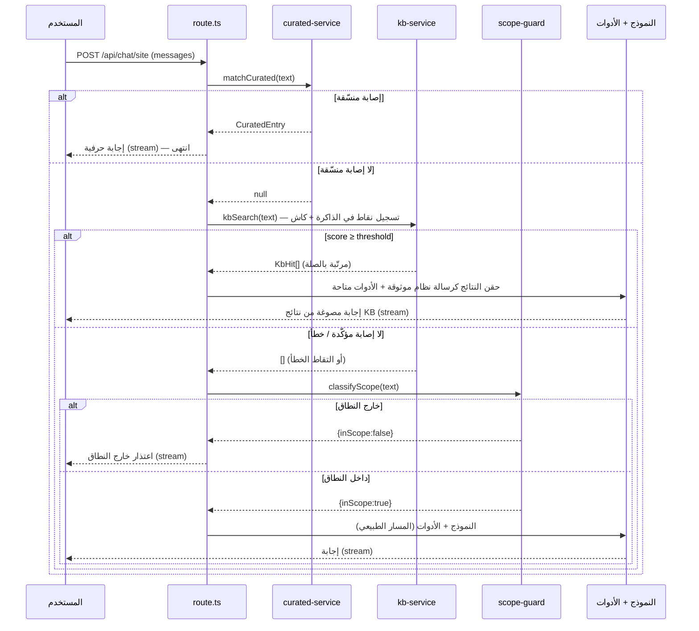

# وثيقة التصميم: قاعدة المعرفة الخاصة (Private Knowledge Base)

## Overview
**نظرة عامة**

قاعدة المعرفة (KB) هي **مخزن معرفي خاص وقابل للبحث** يحتوي معلومات وإجابات كاملة
**غير منشورة على الموقع** وغير موجودة في قاعدتَي المحتوى (`ka_db` / `alkafeel_projects`)،
لكن يجب أن يكون البوت قادراً على الإجابة منها. الهدف أن تكون هذه القاعدة **أحدث وأوثق
مصدر**، فتُستشار **قبل** بقية مصادر المحتوى (الأخبار/المشاريع/الأماكن…).

هذه الميزة **ليست** ميزة الإجابات المنسّقة (`curated_answers`). الفرق جوهري:

| البُعد | `curated_answers` (الاستثناءات) | `kb_articles` (قاعدة المعرفة) |
|--------|--------------------------------|-------------------------------|
| آلية المطابقة | نمط حرفي (word-boundary) → إجابة حرفية | بحث نصّي بتسجيل نقاط في الذاكرة + درجة صلة |
| دور النموذج | **يُتجاوَز** (short-circuit، إجابة حرفية) | **يصوغ الإجابة** من النتائج بأسلوبه |
| طبيعة المحتوى | إجابات قانونية/عقائدية قانونية محدّدة | معرفة قابلة للبحث والصياغة |
| القاعدة الحاكمة | نص ثابت لا يتغيّر | «السرد والشرح من النتائج حصراً» |

المبدأ الحاكم للصياغة: البوت **يشرح ويسرد من نتائج قاعدة المعرفة حصراً** ولا يخترع من
معرفته الخاصة، تماماً كما هو الحال مع نتائج الأدوات.

### أهداف التصميم (Goals)

1. **العزل التام**: جدول `kb_articles` واحد في قاعدة السجلّات المعزولة
   `local_chatbot_logs` فقط، عبر `CREATE TABLE IF NOT EXISTS`. لا `ALTER`/`DROP`،
   ولا أي مساس بـ `ka_db` / `alkafeel_projects`. إضافي وقابل للعكس بالكامل.
2. **الأولوية**: تُستشار قاعدة المعرفة **قبل** حارس النطاق والنموذج والأدوات (وبعد
   `matchCurated` فقط).
3. **الأداء دون الثانية** («أجزاء الثواني»): تسجيل نقاط في الذاكرة فوق لقطة (snapshot)
   مخزّنة بكاش داخلي بـ TTL، بحيث لا يُبطئ الإجابة؛ أول بحث في كل نافذة TTL يُصدر
   استعلام SELECT بسيطاً واحداً للصفوف المفعّلة (يُخزَّن 5 دقائق)، وعدم الإصابة لا يضيف
   أي جولة إضافية مع النموذج.
4. **التدهور الآمن**: أي فشل في قاعدة المعرفة يُلتقط ويُتابَع المسار الطبيعي (نفس نمط
   `try/catch` حول `matchCurated` في `route.ts`).
5. **قابلية التوسّع**: إدارة عبر قشرة الإدارة المُوجَّهة بالبيانات (ADMIN_SECTIONS)
   وطبقة خدمة تحاكي `curated-service.ts`، مع مسار ترقية مستقبلي إلى البحث الدلالي
   (embeddings/RAG) دون إعادة هيكلة السطح.

---

## Architecture
**البنية المعمارية**

```mermaid
graph TD
    U[رسالة المستخدم] --> R[app/api/chat/site/route.ts]
    R --> C1{matchCurated؟}
    C1 -- إصابة حرفية --> OUT1[إجابة منسّقة حرفية · short-circuit]
    C1 -- لا --> KB{kbSearch أعلى من العتبة؟}
    KB -- إصابة مؤكّدة --> INJ[حقن النتائج كسياق موثوق · system message]
    KB -- لا إصابة --> SG{classifyScope}
    INJ --> MODEL[نموذج + أدوات · يصوغ من النتائج]
    SG -- خارج النطاق --> OUT2[اعتذار خارج النطاق]
    SG -- داخل النطاق --> MODEL
    MODEL --> OUT3[إجابة متدفّقة]

    KB -. يقرأ .-> SVC[lib/server/kb-service.ts]
    SVC -. كاش TTL + استعلام واحد .-> DB[(local_chatbot_logs · kb_articles)]

    subgraph إدارة
      ADMIN[app/[locale]/admin/knowledge] --> API[/api/knowledge · requireAdmin/]
      API --> SVC
    end
```

**مكوّنات جديدة (كلها إضافية):**

- `lib/server/kb-service.ts` — طبقة الخدمة (مجمّع معزول + كاش + بحث + CRUD).
- `lib/server/kb-validation.ts` — تحقّق نقيّ من المدخلات (يحاكي `curated-validation.ts`).
- `app/api/knowledge/route.ts` + `app/api/knowledge/[id]/route.ts` + `app/api/knowledge/refresh/route.ts` — واجهات الإدارة المحمية بـ `requireAdmin`.
- `app/[locale]/admin/knowledge/page.tsx` — صفحة CRUD تعيد استخدام `_shared.tsx`.
- قسم جديد «قاعدة المعرفة» في `ADMIN_SECTIONS` داخل `_AdminShell.tsx`.
- نقطة حقن واحدة في `app/api/chat/site/route.ts` (بعد `matchCurated` وقبل `classifyScope`).

**مكوّنات تُعدَّل بأقل قدر ممكن:** `route.ts` (إضافة كتلة `try/catch` واحدة)،
و`_AdminShell.tsx` (عنصر واحد في `ADMIN_SECTIONS`). لا تغيير على أي خدمة قائمة.

---

## المخطط التسلسلي لخطّ المعالجة (Sequence Diagram)



---

## قرار التكامل: أين تجلس قاعدة المعرفة؟ (Integration Decision)

طُرح خياران لدمج قاعدة المعرفة في خطّ المعالجة، وتم اعتماد الأول أساساً.

### الخيار (أ) — الاسترجاع المسبق وحقن السياق (Pre-retrieval Injection) ✅ المعتمد

بعد فشل `matchCurated` وقبل `classifyScope`، نُنفّذ `kbSearch()`. إذا تجاوزت أفضل
النتائج عتبة الثقة، تُحقَن هذه النتائج **كرسالة نظام موثوقة** تُضاف إلى `messagesWithSystem`
بحيث يُفضّلها النموذج ويصوغ منها الإجابة، بينما تبقى الأدوات متاحة للتكميل/الرجوع.

**لماذا هذا الخيار؟**

- **يضمن الأولوية «قبل الباقي» حتمياً**: الاستدعاء يقع في الكود قبل حارس النطاق
  وقبل قرار النموذج باستدعاء الأدوات — لا يعتمد على «اقتناع» النموذج باستدعاء أداة.
- **الحتمية**: قرار الإصابة/عدمها يتّخذه الكود عبر عتبة رقمية، لا النموذج.
- **السرعة**: تسجيل نقاط في الذاكرة (أو ضربة كاش) قبل أي استدعاء للنموذج؛ لا جولة
  إضافية ذهاباً وإياباً مع النموذج كما يحدث في مسار الأدوات (`tool_choice:"required"`
  يكلّف استدعاء نموذج كامل لاختيار الأداة).
- **التدهور الآمن**: عند عدم الإصابة نُكمل المسار الطبيعي بلا أي تكلفة تُذكر.

### الخيار (ب) — أداة نموذج `search_knowledge` (Model Tool)

تسجيل أداة في `site-tools-definitions.ts` وربطها في `function-calling-handler.ts`
بنمط early-return (كما `search_projects_db`)، مع توجيه النموذج لاستدعائها أولاً.

**العيوب مقابل (أ):**

- لا يضمن «قبل الباقي»: ترتيب استدعاء الأدوات بيد النموذج، وقد يختار أداة أخرى.
- يضيف جولة استدعاء نموذج كاملة قبل ظهور نتيجة KB (أبطأ).
- غير حتمي: يعتمد على وصف الأداة وميل النموذج.

### القرار النهائي

اعتماد **(أ) كآلية أساسية** لضمان الأولوية والحتمية والسرعة. ويمكن **اختيارياً**
كشف **(ب) كأداة تكميلية** لاحقاً (`search_knowledge`) ليتمكّن النموذج من استدعاء
قاعدة المعرفة أثناء الحوار متعدّد الأدوار عند الحاجة — دون أن تكون هي المسار الأساسي.
تشترك الأداة التكميلية في نفس `kbSearch()` من طبقة الخدمة، فلا ازدواج منطق.

### قرار فرعي: قصر المسار أم الحقن والصياغة؟

- **الموصى به (الافتراضي): الحقن والصياغة (inject-and-phrase)** — تُحقَن النتائج
  ويصوغ النموذج الإجابة بأسلوبه متّسقاً مع قاعدة «السرد والشرح من النتائج حصراً»،
  مع بقاء الأدوات متاحة للتكميل. هذا يحافظ على جودة اللغة وسلاسة الحوار.
- **خيار متاح: قصر المسار عالي الثقة (high-confidence short-circuit)** — عند تجاوز
  عتبة عليا (`SHORT_CIRCUIT_THRESHOLD`) ووجود حقل `answer` جاهز، يمكن إرجاع نصّ
  المقالة مباشرةً بنمط `matchCurated` (stream فوري بلا نموذج) لتوفير الكمون. يُترك
  هذا الخيار خلف علم (flag) في الخدمة، معطّلاً افتراضياً، ويُفعّل عند الحاجة.

---

## Data Models
**نموذج البيانات**

### جدول `kb_articles` (في `local_chatbot_logs` فقط)

```sql
CREATE TABLE IF NOT EXISTS kb_articles (
  id           BIGINT UNSIGNED AUTO_INCREMENT PRIMARY KEY,
  title        VARCHAR(512) NOT NULL,
  body         MEDIUMTEXT   NOT NULL,
  keywords     TEXT         NULL,              -- كلمات مفتاحية/وسوم (مفصولة بفواصل)
  search_text  MEDIUMTEXT   NOT NULL,          -- نصّ مطبّع للبحث (normalizeArabic(title+body+keywords))
  active       TINYINT(1)   NOT NULL DEFAULT 1,
  priority     INT          NOT NULL DEFAULT 0,-- كسر التعادل عند تساوي الصلة
  note         TEXT         NULL,
  created_at   DATETIME     DEFAULT CURRENT_TIMESTAMP,
  updated_at   DATETIME     DEFAULT CURRENT_TIMESTAMP ON UPDATE CURRENT_TIMESTAMP,
  INDEX idx_active_priority (active, priority)
) ENGINE=InnoDB DEFAULT CHARSET=utf8mb4 COLLATE=utf8mb4_unicode_ci;
```

**ملاحظة محمولية**: الجدول **لا يحتوي فهرس FULLTEXT** (للحفاظ على المحمولية بين
MariaDB وMySQL وتفادي مشاكل التوكنة العربية الخاصّة بالمحرّك). يبقى عمود `search_text`
المطبّع مستخدَماً، لكنه يُمسَح **في الذاكرة** من لقطة (snapshot) مخزّنة بالكاش بدل
`MATCH ... AGAINST`.

**قرارات التصميم:**

- **`search_text` مطبّع**: نُخزّن نسخة مطبّعة عبر `normalizeArabic` (نفس دالة `faq.ts`)
  من `title + body + keywords`، ويُستخدم للمطابقة **في الذاكرة**. هذا يجعل البحث متّسقاً مع
  التطبيع العربي (توحيد الهمزات/الألف/التاء المربوطة) بدل الاعتماد على النصّ الخام.
- **`idx_active_priority`**: لتصفية `active=1` وترتيب كسر التعادل بسرعة.
- **`keywords`**: يرفع الصلة للمصطلحات المرادفة التي قد لا ترد حرفياً في المتن.
- لا مفاتيح أجنبية ولا علاقات بأي جدول محتوى — الجدول مستقلّ تماماً.

### قواعد التحقّق (Validation Rules)

- `title`: نصّ غير فارغ بعد التقليم (إلزامي) → «العنوان مطلوب».
- `body`: نصّ غير فارغ بعد التقليم (إلزامي) → «نص المقالة مطلوب».
- `keywords`: اختياري؛ تُنظّف (تقليم + إسقاط الفارغ + إزالة التكرار) وتُخزّن مفصولة بفواصل.
- `priority`: اختياري؛ عدد صحيح (افتراضي 0) → «الأولوية يجب أن تكون عدداً صحيحاً».
- `active`: اختياري منطقي (افتراضي true) → «الحقل active يجب أن يكون قيمة منطقية».

`search_text` **يُشتقّ في الخدمة** (لا يأتي من الـ API) لضمان الاتساق.

---

## Components and Interfaces
**المكوّنات والواجهات والأنواع الأساسية**

```typescript
// النوع المُصدَّر من نتيجة البحث (يُحقَن في السياق أو يُصاغ منه)
export interface KbHit {
  id: number
  title: string
  body: string
  keywords: string[]
  priority: number
  score: number          // درجة صلة محمولة بمقياس 0..10 (نسبة رموز الاستعلام المُطابَقة)
}

// صفّ القائمة الكامل للوحة الإدارة (يشمل غير المفعّل + updated_at + note)
export interface KbRow {
  id: number
  title: string
  body: string
  keywords: string[]
  active: boolean
  priority: number
  note?: string | null
  updated_at: string
}

// حمولة الإنشاء/التعديل القادمة من الـ API (بعد التحقّق)
export interface KbInput {
  title: string
  body: string
  keywords?: string[]
  priority?: number
  active?: boolean
  note?: string | null
}

// خيارات البحث
export interface KbSearchOpts {
  limit?: number         // افتراضي 3، أقصى 10
  minScore?: number      // تجاوز عتبة الثقة الافتراضية (اختباري)
}
```

## طبقة الخدمة: `lib/server/kb-service.ts`

تحاكي `curated-service.ts` بدقّة: مجمّع اتصال معزول خاص، كاش داخلي بـ TTL،
`refresh()` بعد كل كتابة، وكل استعلامات SQL **مُعامَلة** (`?`).

### دوال التوقيع مع المواصفات الشكلية (Key Functions with Formal Specifications)

```typescript
// (1) إنشاء الجدول idempotently — CREATE TABLE IF NOT EXISTS فقط
async function ensureTable(): Promise<void>
```
- **الشرط المسبق**: توفّر بيئة قاعدة البيانات (`getDatabaseConfig`).
- **الشرط اللاحق**: وجود `kb_articles` في `local_chatbot_logs` مع فهارسه؛ لا `ALTER`/`DROP`؛ idempotent (`tableReady` يمنع التكرار).

```typescript
// (2) البحث الأساسي — تسجيل نقاط في الذاكرة فوق لقطة مخزّنة بالكاش
export async function kbSearch(query: string, opts?: KbSearchOpts): Promise<KbHit[]>
```
- **الشرط المسبق**: `query` سلسلة؛ الرسائل الأقصر من `MIN_LENGTH` تُرفض مبكراً.
- **الشرط اللاحق**: تُعاد مصفوفة `KbHit[]` مرتّبة تنازلياً حسب `(score, priority)`،
  محدودة بـ `limit`، وكل عنصر `score ≥ threshold`. عند عدم وجود نتيجة فوق العتبة
  تُعاد `[]`. لا آثار جانبية على قاعدة البيانات.
- **الثبات الحلقي (Loop invariant)**: أثناء ترشيح النتائج، كل عنصر مُبقىً حقّق
  `score ≥ threshold` وكل المُسقَطات دونها.

```typescript
// (3) إبطال الكاش — يُستدعى بعد كل كتابة إدارية
export function refresh(): void
```
- **الشرط اللاحق**: `cache=null` ويُعاد التحميل عند الطلب التالي.

```typescript
// (4) إدارة (Admin CRUD) — كلها مُعامَلة، وتنتهي كتاباتها بـ refresh()
export async function listAll(): Promise<KbRow[]>
export async function getById(id: number): Promise<KbRow | null>
export async function create(input: KbInput): Promise<KbRow>
export async function update(id: number, input: Partial<KbInput>): Promise<KbRow | null>
export async function setActive(id: number, active: boolean): Promise<KbRow | null>
export async function remove(id: number): Promise<boolean>
```
- **الشرط المسبق (create/update)**: `input` مُتحقَّق منه؛ `title`/`body` غير فارغين.
- **الشرط اللاحق (create/update)**: يُشتقّ `search_text = normalizeArabic(title+" "+body+" "+keywords)`
  ويُخزَّن؛ يُستدعى `refresh()`؛ يُعاد الصفّ الكامل.
- **الشرط اللاحق (remove)**: يُعاد `true` إن حُذف صفّ فعلاً، ويُستدعى `refresh()`.

### الكاش الداخلي مع TTL (نفس نمط curated-service)

```typescript
let cache: KbRow[] | null = null
let cacheLoadedAt = 0
const CACHE_TTL_MS = 5 * 60 * 1000  // 5 دقائق — مطابق لـ curated-service
```

**استراتيجية الكاش**: يُحمّل `kbSearch` كل الصفوف المفعّلة (`active=1`) إلى لقطة في
الذاكرة عبر استعلام SELECT بسيط واحد بلا معطيات مستخدم:

```sql
SELECT id, title, body, keywords, priority, search_text
FROM kb_articles
WHERE active = 1;
```

تُخزَّن هذه اللقطة بكاش داخلي بـ TTL (`CACHE_TTL_MS`، 5 دقائق)، ثم يجري البحث كلّياً
**في الذاكرة** فوقها (تسجيل نقاط على `search_text` المطبّع) دون أي جولة قاعدة بيانات في
الضربات الحارّة. لأن قاعدة المعرفة الخاصّة صغيرة نسبياً (عشرات/مئات المقالات) فهذا المسار
محمول وحتمي ودون الثانية. الاستعلام أعلاه بلا مدخلات مستخدم، وتبقى كل عمليات الإدارة
(CRUD) مُعامَلة (`?`). تبقى بنية `refresh()` تُبطل الكاش فور أي تعديل إداري.

### درجة الصلة وعتبة الثقة (Relevance Score & Confidence Threshold)

```typescript
const MIN_LENGTH = 5               // تجاهل الرسائل القصيرة جداً (مطابق لـ faq/curated)
const MIN_TOKEN_LEN = 2            // أقصر رمز (token) يُعتدّ به في المطابقة
const DEFAULT_LIMIT = 3
const CONFIDENCE_THRESHOLD = 4.0   // ≈40% من رموز الاستعلام مُطابَقة (على مقياس 0..10)
const SHORT_CIRCUIT_THRESHOLD = 9.0 // ≈90% — عتبة قصر المسار عالي الثقة (معطّلة افتراضياً)
```

- درجة الصلة **محمولة بمقياس 0..10** تمثّل نسبة رموز الاستعلام المُطابَقة (ليست درجة
  FULLTEXT من قاعدة البيانات).
- **إصابة مؤكّدة** ⇔ أعلى درجة `≥ CONFIDENCE_THRESHOLD` (أي ≈40% من الرموز).
- تُضبط العتبة تجريبياً على بيانات حقيقية (انظر قسم الأداء والمخاطر): قيمة عالية جداً
  تُفوّت إصابات صحيحة (false negatives)؛ منخفضة جداً تَحقن ضوضاء (false positives).

### آلية تسجيل النقاط (Scoring)

يُطبّع الاستعلام عبر `normalizeArabic` ثم يُقسَّم إلى رموز (tokens) فريدة بطول
`≥ MIN_TOKEN_LEN`. لكل صفّ في اللقطة المخزّنة، نَعُدّ كم رمزاً من رموز الاستعلام يظهر
كسلسلة فرعية داخل `search_text` المطبّع لذلك الصفّ (`matched`). ثم:

```
score = (matched / totalTokens) * 10     // مقياس 0..10
```

نُبقي الصفوف التي `score ≥ threshold`، ونرتّبها تنازلياً حسب `(score, priority)`،
ونقتطع إلى `limit`. الدرجة نسبة صلة محدودة بين 0 و10 (محمولة وحتمية)، لا درجة FULLTEXT.

## الشيفرة الخوارزمية (Algorithmic Pseudocode)

### خوارزمية `kbSearch`

```
ALGORITHM kbSearch(query, opts)
INPUT:  query نصّ المستخدم، opts خيارات اختيارية
OUTPUT: KbHit[] مرتّبة تنازلياً بالصلة، كلها ≥ العتبة

BEGIN
  q ← normalizeArabic(query)
  IF q = ∅ OR length(q) < MIN_LENGTH THEN
    RETURN []                       // تجاهل القصير جداً — لا استعلام أصلاً
  END IF

  threshold ← opts.minScore OR CONFIDENCE_THRESHOLD
  limit     ← clamp(opts.limit OR DEFAULT_LIMIT, 1, 10)

  tokens ← unique(split(q))  ∩  { t : length(t) ≥ MIN_TOKEN_LEN }
  IF tokens = ∅ THEN RETURN [] END IF

  ensureTable()
  rows ← getSnapshot()               // لقطة مخزّنة بالكاش (SELECT بسيط واحد لكل نافذة TTL)

  hits ← []
  FOR each row IN rows DO
    matched ← count(t ∈ tokens WHERE t ⊂ row.search_text)   // سلسلة فرعية
    score   ← (matched / |tokens|) * 10                     // مقياس 0..10
    IF score ≥ threshold THEN
      hits.add(mapHit(row, score))
    END IF
  END FOR

  sort(hits) DESC BY (score, priority)
  RETURN slice(hits, limit)
END
```
- **الشرط المسبق**: `query` سلسلة.
- **الشرط اللاحق**: النتائج كلها فوق العتبة ومرتّبة؛ عند لا شيء تُعاد `[]`؛ لا كتابة على القاعدة.

### خوارزمية التكامل في `route.ts` (نقطة الحقن)

```
ALGORITHM handleUserMessage(lastMessage)   // مقتطف من POST
BEGIN
  // (1) الإجابات المنسّقة أولاً — كما هو قائم اليوم
  curated ← TRY matchCurated(lastMessage.content) CATCH → null
  IF curated ≠ null THEN
    RETURN streamVerbatim(curated)   // short-circuit قائم
  END IF

  // (2) قاعدة المعرفة — الاسترجاع المسبق (جديد)، بتدهور آمن
  kbHits ← []
  TRY
    kbHits ← kbSearch(lastMessage.content)
  CATCH err
    log("[KB] search failed, continuing:", err)
    kbHits ← []                      // فشل ⇒ متابعة المسار الطبيعي
  END TRY

  IF kbHits.length > 0 THEN
    // خيار قصر المسار عالي الثقة (معطّل افتراضياً)
    IF SHORT_CIRCUIT_ENABLED AND kbHits[0].score ≥ SHORT_CIRCUIT_THRESHOLD THEN
      RETURN streamVerbatim(kbHits[0].body)
    END IF
    // المسار الموصى به: حقن كسياق موثوق ثمّ يصوغ النموذج
    kbSystemMessage ← buildKbContext(kbHits)   // "أجب من المعلومات التالية حصراً…"
    injectedContext ← kbSystemMessage
    // ملاحظة: لا نُرجع هنا — نتابع إلى بناء الرسائل واستدعاء النموذج + الأدوات
  END IF

  // (3) حارس النطاق — كما هو قائم (يُتخطّى منطقياً عند وجود إصابة KB مؤكّدة إن رُغب)
  IF injectedContext = ∅ THEN
    scope ← classifyScope(lastMessage.content)
    IF NOT scope.inScope THEN
      RETURN streamOutOfScope()
    END IF
  END IF

  // (4) النموذج + الأدوات — تُدمج injectedContext في messagesWithSystem إن وُجدت
  RETURN streamModelWithTools(messagesWithSystem + injectedContext)
END
```

**ملاحظة الترتيب**: عند وجود إصابة KB مؤكّدة، يُتخطّى حارس النطاق منطقياً لأن قاعدة
المعرفة تُثبت أن السؤال ضمن النطاق (لدينا معرفة صريحة عنه). عند عدم الإصابة، يبقى حارس
النطاق كما هو تماماً.

### بناء سياق قاعدة المعرفة

```
FUNCTION buildKbContext(hits)
BEGIN
  header ← "لديك معلومات موثوقة من قاعدة المعرفة الخاصة. أجب من هذه المعلومات
            حصراً وبأسلوبك، ولا تخترع ما ليس فيها:"
  blocks ← hits.map(h → "### " + h.title + "\n" + h.body)
  RETURN { role: "system", content: header + "\n\n" + join(blocks, "\n\n") }
END
```

## مثال الاستخدام (Example Usage)

```typescript
// داخل route.ts — بعد فشل matchCurated وقبل classifyScope
let kbContext: ChatCompletionMessageParam | null = null
if (lastMessage.role === "user") {
  try {
    const hits = await kbSearch(lastMessage.content)   // C: تدهور آمن
    if (hits.length > 0) {
      console.log(`[KB] hit score=${hits[0].score.toFixed(2)} for: "${lastMessage.content.slice(0, 60)}"`)
      kbContext = buildKbContext(hits)
    }
  } catch (err) {
    console.error("[KB] search failed, continuing:", err)
  }
}

// حقن السياق الموثوق قبل رسائل المستخدم عند وجود إصابة
const messagesWithSystem: ChatCompletionMessageParam[] = [
  { role: "system", content: systemPrompt },
  ...(kbContext ? [kbContext] : []),
  ...sanitizedMessages.map(m => ({ role: m.role, content: m.content })),
]
```

```typescript
// إدارة — إنشاء مقالة معرفة
const row = await create({
  title: "سياسة استقبال الوفود الرسمية",
  body: "تُنظّم زيارات الوفود عبر ... (معلومة غير منشورة على الموقع)",
  keywords: ["الوفود", "الزيارات الرسمية", "البروتوكول"],
  priority: 5,
})
refresh()  // يُستدعى داخل create ضمنياً
```

---

## طبقة الإدارة (Admin Layer)

### القسم الجديد في `ADMIN_SECTIONS` (data-driven)

إضافة عنصر واحد فقط في `app/[locale]/admin/_AdminShell.tsx` (بلا أي تعديل آخر في القشرة):

```typescript
const ADMIN_SECTIONS: AdminSection[] = [
  { key: "analytics",  label: "التحليلات",     href: "/admin",            icon: "📊" },
  { key: "exceptions", label: "الاستثناءات",   href: "/admin/exceptions", icon: "⚠️" },
  { key: "knowledge",  label: "قاعدة المعرفة", href: "/admin/knowledge",  icon: "📚" }, // ← جديد
]
```

### صفحة CRUD: `app/[locale]/admin/knowledge/page.tsx`

مكوّن `"use client"` يحاكي `admin/exceptions/page.tsx` بدقّة: جدول CRUD مع نموذج
إضافة/تعديل منبثق، مفتاح تبديل التفعيل (PATCH)، حوار تأكيد قبل الحذف، وزر «تحديث الكاش».
يعيد استخدام `C, FONT_FAMILY, thStyle, tdStyle, Badge, EmptyState, Toast, ConfirmDialog`
من `_shared.tsx`. عند 401 يعيد التوجيه إلى `/{locale}/admin/login`. أعمدة الجدول
المقترحة: `# | العنوان | معاينة المتن | الكلمات المفتاحية | الأولوية | مفعّل | آخر تحديث | إجراءات`.

يُعرّف الصفحة نوعاً محلّياً بشكل `KbRow` (لا يستورد شيفرة خادم داخل مكوّن عميل).

### واجهات الـ API (كلها محمية بـ `requireAdmin`)

جميعها بنمط `route.ts` القائم: `export const dynamic = "force-dynamic"` و`runtime = "nodejs"`،
وأول سطر في كل معالج: `const deny = requireAdmin(req); if (deny) return deny`.

| المسار | الطريقة | الوصف | الخدمة |
|--------|---------|-------|--------|
| `/api/knowledge` | `GET` | قائمة كل المقالات (مفعّلة وغير مفعّلة) | `listAll()` |
| `/api/knowledge` | `POST` | إنشاء مقالة (تحقّق كامل) | `create()` |
| `/api/knowledge/[id]` | `PUT` | تعديل جزئي | `update()` |
| `/api/knowledge/[id]` | `PATCH` | تبديل التفعيل فقط | `setActive()` |
| `/api/knowledge/[id]` | `DELETE` | حذف مقالة | `remove()` |
| `/api/knowledge/refresh` | `POST` | إبطال الكاش يدوياً | `refresh()` |

**نمط التحقّق** (`lib/server/kb-validation.ts`) يحاكي `curated-validation.ts`: دالة
`validateKbInput(body, { partial })` نقيّة تُعيد `{ ok, error?, value? }` برسائل عربية،
مع تنظيف `keywords` (تقليم + إسقاط الفارغ + إزالة التكرار)، ودالة `parseKeywords(raw)`
لتحويل نصّ مفصول بفواصل/أسطر إلى مصفوفة.

مثال مطابق للنمط القائم:

```typescript
// app/api/knowledge/route.ts
import { requireAdmin } from "@/lib/server/admin-auth"
import { listAll, create } from "@/lib/server/kb-service"
import { validateKbInput } from "@/lib/server/kb-validation"

export const dynamic = "force-dynamic"
export const runtime = "nodejs"

export async function GET(req: Request) {
  const deny = requireAdmin(req); if (deny) return deny
  try {
    const entries = await listAll()
    return Response.json({ entries }, { headers: { "Cache-Control": "no-store" } })
  } catch (err: any) {
    console.error("[KB API GET]", err)
    return Response.json({ error: err.message }, { status: 500 })
  }
}

export async function POST(req: Request) {
  const deny = requireAdmin(req); if (deny) return deny
  try {
    const body = await req.json()
    const result = validateKbInput(body)
    if (!result.ok) return Response.json({ error: result.error }, { status: 400 })
    const entry = await create(result.value!)
    return Response.json({ entry }, { status: 201 })
  } catch (err: any) {
    console.error("[KB API POST]", err)
    return Response.json({ error: err.message }, { status: 500 })
  }
}
```

---

## اعتبارات الأداء (Performance Considerations)

الهدف: بحث **دون الثانية** («أجزاء الثواني») لا يُبطئ الإجابة.

1. **تسجيل نقاط في الذاكرة فوق لقطة صغيرة مخزّنة**: البحث يجري كلّياً في الذاكرة على
   لقطة صغيرة (عشرات/مئات الصفوف)، فزمنه دون المليّ ثانية بلا مسح قاعدة بيانات.
2. **استعلام واحد لكل نافذة TTL**: أول بحث في النافذة يُصدر استعلام SELECT بسيطاً واحداً
   للصفوف المفعّلة (يُخزَّن 5 دقائق)، وتُخدَم بقية الأبحاث من الكاش بلا استعلام. **الإصابة**
   تحقن سياقاً فيوفّر مسار الأدوات (`tool_choice:"required"` الذي يكلّف استدعاء نموذج)،
   و**عدم الإصابة** لا يضيف أي جولة إضافية مع النموذج — كمون ضئيل.
3. **الكاش الداخلي بـ TTL**: `CACHE_TTL_MS = 5 دقائق` (مطابق لـ curated) — يُبطَل فوراً
   عبر `refresh()` بعد أي كتابة إدارية، فتظهر التعديلات آنياً.
4. **حدّ المجمّع**: `connectionLimit: 3` (مطابق لـ curated-service) على المجمّع المعزول،
   يكفي لحمل قاعدة المعرفة دون منافسة مجمّعات المحتوى.
5. **ضبط العتبة (threshold tuning)**: تُبدأ `CONFIDENCE_THRESHOLD` عند قيمة محافظة
   (≈40% من الرموز) وتُعاير على سجلّات حقيقية: قِس نسبة الإصابات الصحيحة/الخاطئة، وارفع
   العتبة إن ظهرت ضوضاء، واخفضها إن فاتت إجابات صحيحة. الدرجة نسبة رموز مُطابَقة بمقياس
   0..10، لا تعتمد على أي إعداد خادم.
6. **حدّ النتائج**: `LIMIT` صغير (افتراضي 3) يقلّل حجم السياق المحقون وكلفة التوكنات.

---

## Error Handling
**معالجة الأخطاء**

| السيناريو | الشرط | الاستجابة | الاسترداد |
|-----------|-------|-----------|-----------|
| فشل بحث KB | استثناء من `kbSearch` (اتصال/SQL) | التقاط في `try/catch` وتسجيله | متابعة المسار الطبيعي (scope-guard + نموذج) بلا حقن |
| لا إصابة فوق العتبة | `kbHits = []` | لا حقن | المسار الطبيعي كما هو |
| صفّ معطوب | تعذّر تحليل `keywords` | إسقاط الصفّ (mapHit → استبعاد) | بقية النتائج سليمة |
| فشل الجدول | تعذّر `ensureTable` | يُرفع للـ catch الأعلى | تدهور آمن كما أعلاه |
| خطأ إداري | فشل CRUD | 500 برسالة عربية (نمط curated) | لا تأثير على مسار الشات |

**المبدأ**: قاعدة المعرفة **إضافة تعزيزية**؛ فشلها لا يجب أن يُعطّل الإجابة أبداً — نفس
فلسفة `try/catch` حول `matchCurated` في `route.ts` اليوم.

---

## Correctness Properties
**خصائص الصحّة**

### Property 1: العزل (Isolation)
`∀` عملية KB، تُنفَّذ حصراً على `local_chatbot_logs.kb_articles`، ولا تلمس
`ka_db`/`alkafeel_projects`، ولا تصدر `ALTER`/`DROP`.

### Property 2: الأولوية (Ordering priority)
`∀` رسالة مستخدم، إن أصابت `matchCurated` فالإجابة منسّقة؛ وإلا يُنفَّذ `kbSearch`
**قبل** `classifyScope` واستدعاء النموذج.

### Property 3: الحتمية (Determinism)
`∀` استعلام، قرار الإصابة يعتمد `score ≥ threshold` فقط — لا عشوائية.

### Property 4: الترتيب (Sorted results)
نتائج `kbSearch` مرتّبة تنازلياً حسب `(score, priority)`.

### Property 5: التدهور الآمن (Safe degradation)
`∀` خطأ في KB، يُنتَج نفس رد المسار الطبيعي كأن الميزة غائبة.

### Property 6: العتبة (Threshold)
`∀ hit ∈ kbSearch(q)` ⟹ `hit.score ≥ threshold`.

### Property 7: حدّية الطول (Min-length guard)
`∀ q` حيث `length(normalizeArabic(q)) < MIN_LENGTH` ⟹ `kbSearch(q) = []` بلا استعلام.

### Property 8: إبطال الكاش (Cache invalidation)
`∀` كتابة إدارية ناجحة ⟹ يُستدعى `refresh()`، فتُرى التعديلات في الطلب التالي.

### Property 9: المُعامَلة (Parameterization)
`∀` استعلام SQL يمرّر قيم المستخدم عبر `?` (لا دمج سلاسل).

---

## اعتبارات الأمان (Security Considerations)

- **SQL مُعامَل**: كل الاستعلامات (بحث + CRUD) عبر `db.execute(sql, params)`؛ لا دمج
  سلاسل مطلقاً — يمنع حقن SQL.
- **حماية الإدارة**: كل مسارات `/api/knowledge*` تبدأ بـ `requireAdmin(req)` (جلسة
  HMAC موقّعة، كوكي `HttpOnly`) قبل أي منطق.
- **العزل**: قاعدة معزولة فقط؛ لا وصول لبيانات المحتوى الحسّاسة.
- **لا `NEXT_PUBLIC_`**: أسرار قاعدة البيانات وإعداداتها تبقى على الخادم فقط (نمط
  `getDatabaseConfig`/متغيّرات البيئة)؛ لا تُسرّب أي قيمة إلى العميل.
- **التطهير**: مسار الشات يمرّ أصلاً عبر `validateAndSanitize`/`sanitizeMessages`
  قبل `kbSearch`، فالمدخل مُطهَّر.
- **الخصوصية**: محتوى KB خاص وغير منشور؛ لا يُعاد إلا كسياق للنموذج ضمن نفس الطلب،
  ولا يُخزَّن في أي وجهة عامّة.

---

## Testing Strategy
**استراتيجية الاختبار**

- **اختبارات وحدة نقيّة**: `validateKbInput` (كل قواعد التحقّق والرسائل العربية)،
  `parseKeywords`، واشتقاق `search_text` عبر `normalizeArabic`.
- **اختبارات SQL**: التحقّق أن `create/update/remove` تُصدر SQL مُعامَلاً صحيحاً وتستدعي
  `refresh()` (نمط `analytics-service.sql.test.ts`).
- **اختبارات مبنية على الخصائص (PBT)**: خاصية «كل نتيجة `≥ threshold`»، وخاصية «الطول
  دون الحدّ ⟹ لا استعلام»، وخاصية «الترتيب التنازلي محفوظ».
- **اختبارات تكامل خطّ المعالجة** (نمط `route.site.integration.test.ts`): إصابة KB
  تحقن السياق؛ فشل KB يتدهور بأمان للمسار الطبيعي؛ `matchCurated` تسبق KB.
- **معايرة العتبة**: مجموعة أسئلة ذهبية (golden set) لضبط `CONFIDENCE_THRESHOLD`.

---

## المخاطر والمقايضات (Risks & Tradeoffs)

- **مطابقة السلاسل الفرعية للرموز**: عدّ الرموز كسلاسل فرعية قد يُنتج مطابقات جزئية
  للكلمات (مثل رمز يظهر داخل كلمة أكبر)؛ تخفيف: التطبيع المسبق (`normalizeArabic`) +
  حقل `keywords` اليدوي + عتبة الـ40%. المقايضة: بساطة وسرعة ومحمولية مقابل فهم دلالي محدود.
- **افتراض صِغَر القاعدة**: المسار في الذاكرة يفترض بقاء قاعدة المعرفة الخاصّة صغيرة
  (عشرات/مئات الصفوف)؛ إن كبرت كثيراً يُنقَل البحث إلى جانب قاعدة البيانات أو إلى بحث شعاعي.
- **حسّاسية العتبة**: قيمة ثابتة قد لا تناسب كل الأسئلة؛ تُخفَّف بالمعايرة على golden set
  وإتاحة `minScore` للاختبار.
- **حجم السياق المحقون**: مقالات طويلة ترفع كلفة التوكنات؛ يُخفَّف بـ `LIMIT` صغير
  وإمكان اقتطاع المتن عند الحقن.
- **ازدواج المعرفة**: تداخل محتمل بين KB والمحتوى المنشور؛ تُدار الأولوية عبر ترتيب
  الاستشارة (KB أولاً) وحقل `priority`.

---

## قابلية التوسّع المستقبلية (Future Extensibility)

مسار الترقية إلى **البحث الدلالي/الشعاعي (embeddings/RAG)** دون إعادة هيكلة السطح:

- **ثبات الواجهة**: يبقى توقيع `kbSearch(query, opts): Promise<KbHit[]>` كما هو؛ يتغيّر
  التنفيذ الداخلي فقط. يتيح ثبات هذا التوقيع استبدال منطق التسجيل الداخلي ببحث FULLTEXT
  على جانب قاعدة البيانات (على MySQL) أو ببحث شعاعي لاحقاً **دون تغيير** `route.ts` أو سطح الإدارة.
- **توسيع الجدول لاحقاً**: إضافة عمود `embedding` (تخزين المتّجه) وجدول/فهرس مرافق —
  عبر `CREATE TABLE IF NOT EXISTS`/إضافة اختيارية (بحث هجين lexical + semantic).
- **ثبات سطح الإدارة**: نماذج CRUD و`KbInput`/`KbRow` لا تتغيّر؛ توليد المتّجهات يجري
  في الخدمة عند الكتابة (خطاف بعد `create/update`).
- **حدود النطاق الحالي**: تنفيذ embeddings/RAG **خارج نطاق** هذه الوثيقة؛ نكتفي الآن
  بالتسجيل في الذاكرة + كاش لتحقيق هدف «أجزاء الثواني» بأقل تعقيد وبمحمولية كاملة.

---

## التبعيات (Dependencies)

- `mysql2/promise` (قائم) — للمجمّع المعزول.
- `normalizeArabic` من `lib/server/faq.ts` (قائم) — للتطبيع المتّسق.
- `getDatabaseConfig` من `lib/server/site-api-config` (قائم) — إعداد الاتصال المعزول.
- `requireAdmin` من `lib/server/admin-auth.ts` (قائم) — حماية الإدارة.
- مكوّنات `_shared.tsx` و`ADMIN_SECTIONS` (قائمة) — لصفحة الإدارة.
- **محمول بين MariaDB وMySQL بلا أي اعتماد على FULLTEXT** — لا حاجة لمحرّك أو مُحلّل خاص.
- **لا تبعيات جديدة**.
